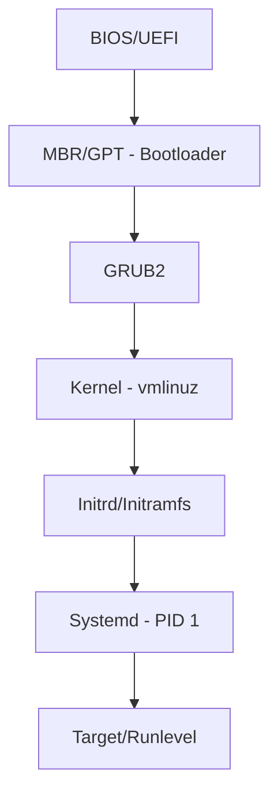

## 4. The Linux Boot Process (Mastery Hub)

Understanding the boot process is critical for troubleshooting "Kernel Panic" or "Init" failures.



### Logic & Trickiness: Boot Failures
| Stage | Failure Symptom | Troubleshooting Step |
| :--- | :--- | :--- |
| **GRUB** | `grub>` prompt | Check `root` and `prefix` variables. Reinstall via Live ISO. |
| **Kernel** | `Kernel Panic - not syncing` | Check for driver conflicts or corrupted `initrd`. |
| **Systemd** | Hangs at "Starting..." | Use `systemd-analyze blame` to find the culprit service. |

***

## 5. Senior Logic & Trickiness: The Kernel Matrix

| Concept | The "Junior" Answer | The "Senior/Staff" Answer |
| :--- | :--- | :--- |
| **OOM Kill** | "It kills the largest process." | "It calculates an **oom_score** based on RSS, child processes, and `oom_score_adj`." |
| **Swap** | "It's slow RAM on disk." | "It provides **Anonymous Page** pressure relief, allowing the kernel to prioritize the **Page Cache** for I/O." |
| **Load Avg** | "CPU usage over time." | "The count of processes in **R** (Running) + **D** (Uninterruptible Sleep) states." |
| **iNode** | "A file index." | "The metadata structure containing pointers to data blocks; exhaustion stops writes even if space is free." |

***

## 1. Advanced Performance Profiling: The USE Method

For senior-level roles, simple "CPU at 80%" alerts are insufficient. You must use the **USE Method** (Utilization, Saturation, Errors) for every system resource.

| Resource | Utilization | Saturation | Errors |
|----------|-------------|------------|--------|
| **CPU** | % Busy | Load Average / Run Queue | Processor Errors |
| **Memory** | % Used | Swap Activity / OOM Events | Correctable ECC Errors |
| **Disk** | % Device Busy | I/O Wait / Queue Length | Device/Driver Errors |
| **Network** | % Bandwidth | Dropped Packets | TCP Retransmissions |

### The eBPF Revolution

eBPF (Extended Berkeley Packet Filter) allows you to run sandboxed programs in the Linux kernel without changing kernel source code or loading modules.

**Tools to Know:**
- `bpftrace` — Command-line tracer
- `bcc-tools` — Collection of eBPF-based tools

**Use Cases:**
- "Show me which process is causing the highest disk latency right now"
- "Trace all `open()` syscalls that are failing with `ENOENT`"

```bash
# Using bpftrace to see disk latency distribution
sudo biolatency.bt

# Trace open() syscalls failing with ENOENT
sudo bpftrace -e 'tracepoint:syscalls:sys_enter_open /retval < 0/ { @failed[comm] = count(); }'
```

***

## 2. Kernel Tuning for High-Scale Workloads

The default Linux kernel settings are for general purpose use. For high-throughput proxies (Nginx) or heavy databases (Postgres), you must tune `/etc/sysctl.conf`.

### TCP Stack Tuning (for Proxies/API Gateways)

```bash
# Increase the max number of open files
fs.file-max = 2097152

# Increase the backlog of connections waiting to be accepted
net.core.somaxconn = 65535

# Increase the range of ephemeral ports to avoid socket exhaustion
net.ipv4.ip_local_port_range = 1024 65535

# Enable TCP Fast Open to reduce handshake latency
net.ipv4.tcp_fastopen = 3

# Reduce TIME_WAIT duration
net.ipv4.tcp_fin_timeout = 30

# Enable port reuse
net.ipv4.tcp_tw_reuse = 1
```

### Virtual Memory Tuning (for Databases)

```bash
# Reduce the 'swappiness' to keep data in physical RAM
vm.swappiness = 10

# Increase the 'dirty_ratio' to allow more data in write cache before flushing
vm.dirty_ratio = 40
vm.dirty_background_ratio = 10

# Disable Transparent Huge Pages for databases
echo never > /sys/kernel/mm/transparent_hugepage/enabled
```

### Apply Changes

```bash
# Apply sysctl changes
sysctl -p

# Verify settings
sysctl net.ipv4.tcp_fastopen
sysctl vm.swappiness
```

***

## 3. Enterprise Hardening & Security

A senior engineer ensures the OS follows the **CIS Benchmarks** (Center for Internet Security).

### Kernel Self-Protection (KSPP)

| Protection | Description |
|------------|-------------|
| **Disable Kernel Module Loading** | `sysctl -w kernel.modules_disabled=1` prevents attackers from inserting malicious rootkits |
| **ASLR** | Address Space Layout Randomization makes buffer overflow attacks significantly harder |
| **Kernel Page Table Isolation** | Protects against Meltdown/Spectre vulnerabilities |

### Linux Security Modules (LSM)

| Module | Distribution | Approach |
|--------|--------------|----------|
| **SELinux** | RHEL/CentOS | Label-based security ("Can process X touch file Y?") |
| **AppArmor** | Ubuntu/Debian | Path-based security ("Can `/usr/sbin/nginx` read `/etc/shadow`?") |

### CIS Hardening Checklist

1. **Partitioning:** Keep `/tmp`, `/var`, and `/home` on separate partitions with `nodev`, `nosuid`, and `noexec` flags

```bash
# /etc/fstab example
/tmp        ext4    defaults,nodev,nosuid,noexec    0 2
/var        ext4    defaults,nodev                  0 2
/var/tmp    ext4    defaults,nodev,nosuid,noexec    0 2
```

2. **SSH Hardening:**

```bash
# /etc/ssh/sshd_config
PermitRootLogin no
Protocol 2
AllowUsers alice bob
PasswordAuthentication no
PubkeyAuthentication yes
MaxAuthTries 3
ClientAliveInterval 300
ClientAliveCountMax 2
```

3. **Auditd Configuration:** Configure the Linux Auditing System to track commands and sensitive file modifications

```bash
# /etc/audit/rules.d/audit.rules
-w /etc/passwd -p wa -k identity
-w /etc/shadow -p wa -k identity
-w /etc/sudoers -p wa -k sudoers
-w /var/log/ -p wa -k logfiles
```

***

## 4. Advanced Process Debugging

### CPU Affinity & Cgroups

In multi-core systems, a process jumping between CPUs causes cache misses.

**CPU Pinning:** Use `taskset` to bind a critical process to specific physical cores.

```bash
# Check current affinity
taskset -cp <PID>

# Bind to cores 0-3
taskset -c 0-3 <command>

# Start process with affinity
taskset -c 0-3 nginx
```

**Cgroups v2:** Move beyond "limiting" resources to "protecting" them.

```bash
# Create cgroup
sudo mkdir /sys/fs/cgroup/myapp
echo 100000 > /sys/fs/cgroup/myapp/cpu.max  # 50% of one CPU
echo <PID> > /sys/fs/cgroup/myapp/cgroup.procs
```

### The Init System (Systemd) Advanced Features

**Watchdogs:** Automatically restart a service if it stops responding.

```ini
# /etc/systemd/system/myapp.service
[Service]
ExecStart=/usr/bin/myapp
WatchdogSec=30
Restart=on-watchdog
```

**Hardening in Systemd:**

```ini
[Service]
ProtectSystem=strict      # Make /usr, /boot, /etc read-only
PrivateTmp=true           # Use private /tmp
NoNewPrivileges=true      # Prevent privilege escalation
ProtectHome=true          # Make /home read-only
ReadWritePaths=/var/lib/myapp  # Only writable path
```

***

## 5. From Scripts to Tooling

### The CLI Evolution

A senior engineer doesn't provide a folder of 20 `.sh` files. They provide a single, packaged, tested CLI tool.

**Python:** Use libraries like `Click` or `Typer` for professional CLI interfaces.

**Go:** Use the `Cobra` library (same as `kubectl`, `hugo`, `docker`). Go produces a single static binary that works on any Linux server without dependency hell.

### Test-Driven Development for Infrastructure

**Unit Testing Infrastructure Code:**
- **Pytest + Mock:** Use `unittest.mock` to intercept network calls
- **Moto:** Mock AWS services in memory

**The "Dry Run" Pattern:**

```bash
# Every production script should support --dry-run
./cleanup-snapshots.sh --dry-run
# Output: "Would delete 42 orphaned snapshots (total: 150GB)"
```

***

## 6. Defensive Programming & Safety Rails

### Handling Throttling (429 Too Many Requests)

Cloud APIs will ban your script if it makes requests too fast.

**Exponential Backoff with Jitter:**

```python
import random
import time

def retry_with_backoff(func, max_retries=5):
    for attempt in range(max_retries):
        try:
            return func()
        except RateLimitError:
            delay = (2 ** attempt) + random.uniform(0, 1)
            time.sleep(delay)
    raise Exception("Max retries exceeded")
```

### Atomic Operations

If a script must perform three steps and step 2 fails, the script should **roll back** to prevent a "half-done" state.

```bash
#!/bin/bash
set -e

cleanup() {
  echo "Rolling back..."
  aws ec2 delete-volume --volume-id $NEW_VOLUME_ID
}

trap cleanup ERR

# Step 1: Create snapshot
SNAPSHOT_ID=$(aws ec2 create-snapshot --volume-id $VOL_ID --query 'SnapshotId' --output text)

# Step 2: Copy to another region
aws ec2 copy-snapshot --source-region us-east-1 --destination-region us-west-2 --source-snapshot-id $SNAPSHOT_ID

# Step 3: Create volume from snapshot
# If this fails, trap will delete the snapshot
```

***

## Summary: Key Takeaways

| Concept | Key Point |
|---------|-----------|
| USE Method | Analyze Utilization, Saturation, Errors for each resource |
| eBPF | In-kernel tracing without modules (`bpftrace`, `bcc-tools`) |
| TCP tuning | `somaxconn`, `ip_local_port_range`, `tcp_fastopen` for high-scale |
| Memory tuning | `vm.swappiness=10` for databases, disable THP |
| CIS Benchmarks | Partition isolation, SSH hardening, auditd |
| CPU affinity | `taskset` binds processes to specific cores |
| Cgroups v2 | Resource protection with `cpu.max`, `memory.low` |
| Systemd hardening | `ProtectSystem=strict`, `PrivateTmp=true`, `NoNewPrivileges` |
| Dry run pattern | Always show what would change before making changes |
| Exponential backoff | Handle API throttling with jitter |
