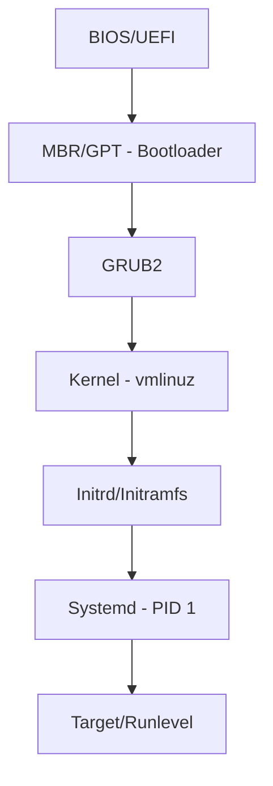

# Advanced Linux — Senior Engineer Deep Dive

```
Advanced Linux — Senior Deep Dive
├── Performance Profiling: USE Method
│   ├── CPU: utilization %, load average / run queue, processor errors
│   ├── Memory: % used, swap activity / OOM events, ECC errors
│   ├── Disk: % device busy, I/O wait / queue length, driver errors
│   └── Network: % bandwidth, dropped packets, TCP retransmissions
├── eBPF Revolution
│   ├── Sandboxed in-kernel programs — no module loading, no source change
│   ├── Tools: bpftrace (CLI), bcc-tools (collection), Cilium (network)
│   ├── biolatency.bt: disk latency distribution histogram
│   └── bpftrace trace open() ENOENT failures by process name
├── Kernel Tuning for High-Scale Workloads
│   ├── TCP Stack (Proxies / API Gateways)
│   │   ├── fs.file-max = 2097152: system-wide open files
│   │   ├── net.core.somaxconn = 65535: listen backlog
│   │   ├── net.ipv4.ip_local_port_range = 1024 65535: ephemeral ports
│   │   ├── net.ipv4.tcp_fastopen = 3: reduce handshake latency
│   │   ├── net.ipv4.tcp_fin_timeout = 30: reduce TIME_WAIT duration
│   │   └── net.ipv4.tcp_tw_reuse = 1: allow TIME_WAIT socket reuse
│   └── VM Tuning (Databases)
│       ├── vm.swappiness = 10: keep data in RAM
│       ├── vm.dirty_ratio = 40: write cache before flush
│       ├── vm.dirty_background_ratio = 10: start background flush early
│       └── Disable THP: echo never > /sys/kernel/mm/transparent_hugepage/enabled
├── Linux Boot Process
│   ├── BIOS/UEFI → MBR/GPT → GRUB2 → vmlinuz
│   ├── Initrd/Initramfs → systemd (PID 1) → Target/Runlevel
│   ├── GRUB failure: grub> prompt, check root/prefix, reinstall via Live ISO
│   ├── Kernel failure: "Kernel Panic - not syncing", driver/initrd issue
│   └── Systemd failure: systemd-analyze blame, find culprit service
├── Senior Logic: Kernel Matrix
│   ├── OOM Kill: oom_score (RSS + adj), not "largest process"
│   ├── Swap: anonymous page overflow, prioritizes page cache for I/O
│   ├── Load Avg: count of R + D state processes (not CPU %)
│   └── iNode: metadata struct; exhaustion stops writes even with free space
├── Enterprise Hardening & Security
│   ├── Kernel Self-Protection (KSPP)
│   │   ├── kernel.modules_disabled=1: prevent rootkit module insertion
│   │   ├── ASLR (randomize_va_space=2): hardens buffer overflow exploits
│   │   └── KPTI: Kernel Page Table Isolation (Meltdown/Spectre mitigation)
│   ├── Linux Security Modules (LSM)
│   │   ├── SELinux: label-based (RHEL/CentOS) — "can X touch Y?"
│   │   └── AppArmor: path-based (Ubuntu/Debian) — "can nginx read /etc/shadow?"
│   └── CIS Hardening Checklist
│       ├── Partitioning: /tmp, /var, /home — separate partitions, nodev/nosuid/noexec
│       ├── SSH: PermitRootLogin no, PasswordAuthentication no, MaxAuthTries 3
│       └── Auditd: watch /etc/passwd, /etc/shadow, /etc/sudoers for writes
├── Advanced Process Debugging
│   ├── CPU Affinity
│   │   ├── taskset -cp <PID>: check affinity
│   │   └── taskset -c 0-3 nginx: bind to cores 0-3
│   ├── Cgroups v2
│   │   ├── Single unified hierarchy (vs v1 separate per-controller)
│   │   ├── cpu.max, memory.low, pids.max
│   │   └── /sys/fs/cgroup/myapp/cgroup.procs: add PID to group
│   └── Systemd Advanced Features
│       ├── WatchdogSec: detect deadlocked "ghost services"
│       └── Hardening: ProtectSystem=strict, PrivateTmp=true, NoNewPrivileges
├── From Scripts to Production Tooling
│   ├── Python CLI: Click / Typer for professional interfaces
│   ├── Go CLI: Cobra library (same as kubectl/docker), single static binary
│   └── TDD for Infrastructure: Pytest + Mock, Moto (mock AWS), --dry-run pattern
└── Defensive Programming
    ├── Exponential Backoff with Jitter: handle 429 rate limits
    ├── Atomic Operations: trap ERR to rollback multi-step changes
    └── Dry Run Pattern: --dry-run flag shows what would change before acting
```

## First Principles

- **General-purpose kernel defaults are a worst-case compromise.** The kernel cannot know if it's running a database or a web proxy. Every performance tuning parameter exists because a specific workload pattern was being destroyed by the wrong default.
- **The USE Method is a framework for eliminating hypotheses.** For each resource, you ask: is it over-utilized? Is it saturated (queue building up)? Are there errors? This systematic approach prevents the common error of "looking at the familiar thing" instead of the actual bottleneck.
- **eBPF is instrumentation without modification.** Traditionally, to measure what the kernel does, you either recompile it (risky, slow) or use `strace` (high overhead). eBPF's verified bytecode runs in-kernel with JIT compilation — near-native speed with no kernel changes.
- **Security hardening is about reducing attack surface.** Every module, service, and capability you don't need is a potential vector. `modules_disabled=1` closes the kernel module attack surface entirely. `PrivateTmp=true` prevents one service from reading another's temp files.
- **Auditd provides forensic capability.** When an incident occurs, you need to answer "what changed, when, and by whom." Without auditd watching `/etc/passwd` and `/etc/sudoers`, you cannot answer those questions from logs alone.
- **The dry-run pattern is a commitment to safety.** Production automation should show its intent before acting. This is not just UX — it's a safeguard against bugs in the "what would I change?" logic that becomes visible before actual damage occurs.

## Why This Matters for DevOps/SRE

At the senior level, you're not just running commands — you're diagnosing why a $50,000/month production cluster is experiencing latency spikes, why pods are being OOMKilled despite "plenty of memory," or why a server won't boot after a kernel update.

**The Senior Engineer's Toolkit:**

1. **Performance Profiling:** Moving beyond `top` to eBPF-based tracing that shows kernel-level behavior
2. **Kernel Tuning:** Default Linux settings are for general-purpose use — high-scale workloads need custom tuning
3. **Boot Troubleshooting:** When a server won't boot, you need to understand each stage to diagnose and recover
4. **Resource Exhaustion:** Understanding inode exhaustion, file descriptor leaks, and socket exhaustion before they cause outages

This document covers the advanced concepts that separate senior engineers from juniors.

***

## 4. The Linux Boot Process (Mastery Hub)

Understanding the boot process is critical for troubleshooting "Kernel Panic" or "Init" failures.


```mermaid
graph TD
    A[BIOS/UEFI] --> B[MBR/GPT - Bootloader]
    B --> C[GRUB2]
    C --> D[Kernel - vmlinuz]
    D --> E[Initrd/Initramfs]
    E --> F[Systemd - PID 1]
    F --> G[Target/Runlevel]
```

### Logic & Trickiness: Boot Failures
| Stage | Failure Symptom | Troubleshooting Step |
| :--- | :--- | :--- |
| **GRUB** | `grub>` prompt | Check `root` and `prefix` variables. Reinstall via Live ISO. |
| **Kernel** | `Kernel Panic - not syncing` | Check for driver conflicts or corrupted `initrd`. |
| **Systemd** | Hangs at "Starting..." | Use `systemd-analyze blame` to find the culprit service. |

***

## 5. Senior Logic & Trickiness: The Kernel Matrix

| Concept | The "Junior" Answer | The "Senior/Staff" Answer |
| :--- | :--- | :--- |
| **OOM Kill** | "It kills the largest process." | "It calculates an **oom_score** based on RSS, child processes, and `oom_score_adj`." |
| **Swap** | "It's slow RAM on disk." | "It provides **Anonymous Page** pressure relief, allowing the kernel to prioritize the **Page Cache** for I/O." |
| **Load Avg** | "CPU usage over time." | "The count of processes in **R** (Running) + **D** (Uninterruptible Sleep) states." |
| **iNode** | "A file index." | "The metadata structure containing pointers to data blocks; exhaustion stops writes even if space is free." |

***

## 1. Advanced Performance Profiling: The USE Method

For senior-level roles, simple "CPU at 80%" alerts are insufficient. You must use the **USE Method** (Utilization, Saturation, Errors) for every system resource.

| Resource | Utilization | Saturation | Errors |
|----------|-------------|------------|--------|
| **CPU** | % Busy | Load Average / Run Queue | Processor Errors |
| **Memory** | % Used | Swap Activity / OOM Events | Correctable ECC Errors |
| **Disk** | % Device Busy | I/O Wait / Queue Length | Device/Driver Errors |
| **Network** | % Bandwidth | Dropped Packets | TCP Retransmissions |

### The eBPF Revolution

eBPF (Extended Berkeley Packet Filter) allows you to run sandboxed programs in the Linux kernel without changing kernel source code or loading modules.

**Tools to Know:**
- `bpftrace` — Command-line tracer
- `bcc-tools` — Collection of eBPF-based tools

**Use Cases:**
- "Show me which process is causing the highest disk latency right now"
- "Trace all `open()` syscalls that are failing with `ENOENT`"

```bash
# Using bpftrace to see disk latency distribution
sudo biolatency.bt

# Trace open() syscalls failing with ENOENT
sudo bpftrace -e 'tracepoint:syscalls:sys_enter_open /retval < 0/ { @failed[comm] = count(); }'
```

***

## 2. Kernel Tuning for High-Scale Workloads

The default Linux kernel settings are for general purpose use. For high-throughput proxies (Nginx) or heavy databases (Postgres), you must tune `/etc/sysctl.conf`.

### TCP Stack Tuning (for Proxies/API Gateways)

```bash
# Increase the max number of open files
fs.file-max = 2097152

# Increase the backlog of connections waiting to be accepted
net.core.somaxconn = 65535

# Increase the range of ephemeral ports to avoid socket exhaustion
net.ipv4.ip_local_port_range = 1024 65535

# Enable TCP Fast Open to reduce handshake latency
net.ipv4.tcp_fastopen = 3

# Reduce TIME_WAIT duration
net.ipv4.tcp_fin_timeout = 30

# Enable port reuse
net.ipv4.tcp_tw_reuse = 1
```

### Virtual Memory Tuning (for Databases)

```bash
# Reduce the 'swappiness' to keep data in physical RAM
vm.swappiness = 10

# Increase the 'dirty_ratio' to allow more data in write cache before flushing
vm.dirty_ratio = 40
vm.dirty_background_ratio = 10

# Disable Transparent Huge Pages for databases
echo never > /sys/kernel/mm/transparent_hugepage/enabled
```

### Apply Changes

```bash
# Apply sysctl changes
sysctl -p

# Verify settings
sysctl net.ipv4.tcp_fastopen
sysctl vm.swappiness
```

***

## 3. Enterprise Hardening & Security

A senior engineer ensures the OS follows the **CIS Benchmarks** (Center for Internet Security).

### Kernel Self-Protection (KSPP)

| Protection | Description |
|------------|-------------|
| **Disable Kernel Module Loading** | `sysctl -w kernel.modules_disabled=1` prevents attackers from inserting malicious rootkits |
| **ASLR** | Address Space Layout Randomization makes buffer overflow attacks significantly harder |
| **Kernel Page Table Isolation** | Protects against Meltdown/Spectre vulnerabilities |

### Linux Security Modules (LSM)

| Module | Distribution | Approach |
|--------|--------------|----------|
| **SELinux** | RHEL/CentOS | Label-based security ("Can process X touch file Y?") |
| **AppArmor** | Ubuntu/Debian | Path-based security ("Can `/usr/sbin/nginx` read `/etc/shadow`?") |

### CIS Hardening Checklist

1. **Partitioning:** Keep `/tmp`, `/var`, and `/home` on separate partitions with `nodev`, `nosuid`, and `noexec` flags

```bash
# /etc/fstab example
/tmp        ext4    defaults,nodev,nosuid,noexec    0 2
/var        ext4    defaults,nodev                  0 2
/var/tmp    ext4    defaults,nodev,nosuid,noexec    0 2
```

2. **SSH Hardening:**

```bash
# /etc/ssh/sshd_config
PermitRootLogin no
Protocol 2
AllowUsers alice bob
PasswordAuthentication no
PubkeyAuthentication yes
MaxAuthTries 3
ClientAliveInterval 300
ClientAliveCountMax 2
```

3. **Auditd Configuration:** Configure the Linux Auditing System to track commands and sensitive file modifications

```bash
# /etc/audit/rules.d/audit.rules
-w /etc/passwd -p wa -k identity
-w /etc/shadow -p wa -k identity
-w /etc/sudoers -p wa -k sudoers
-w /var/log/ -p wa -k logfiles
```

***

## 4. Advanced Process Debugging

### CPU Affinity & Cgroups

In multi-core systems, a process jumping between CPUs causes cache misses.

**CPU Pinning:** Use `taskset` to bind a critical process to specific physical cores.

```bash
# Check current affinity
taskset -cp <PID>

# Bind to cores 0-3
taskset -c 0-3 <command>

# Start process with affinity
taskset -c 0-3 nginx
```

**Cgroups v2:** Move beyond "limiting" resources to "protecting" them.

```bash
# Create cgroup
sudo mkdir /sys/fs/cgroup/myapp
echo 100000 > /sys/fs/cgroup/myapp/cpu.max  # 50% of one CPU
echo <PID> > /sys/fs/cgroup/myapp/cgroup.procs
```

### The Init System (Systemd) Advanced Features

**Watchdogs:** Automatically restart a service if it stops responding.

```ini
# /etc/systemd/system/myapp.service
[Service]
ExecStart=/usr/bin/myapp
WatchdogSec=30
Restart=on-watchdog
```

**Hardening in Systemd:**

```ini
[Service]
ProtectSystem=strict      # Make /usr, /boot, /etc read-only
PrivateTmp=true           # Use private /tmp
NoNewPrivileges=true      # Prevent privilege escalation
ProtectHome=true          # Make /home read-only
ReadWritePaths=/var/lib/myapp  # Only writable path
```

***

## 5. From Scripts to Tooling

### The CLI Evolution

A senior engineer doesn't provide a folder of 20 `.sh` files. They provide a single, packaged, tested CLI tool.

**Python:** Use libraries like `Click` or `Typer` for professional CLI interfaces.

**Go:** Use the `Cobra` library (same as `kubectl`, `hugo`, `docker`). Go produces a single static binary that works on any Linux server without dependency hell.

### Test-Driven Development for Infrastructure

**Unit Testing Infrastructure Code:**
- **Pytest + Mock:** Use `unittest.mock` to intercept network calls
- **Moto:** Mock AWS services in memory

**The "Dry Run" Pattern:**

```bash
# Every production script should support --dry-run
./cleanup-snapshots.sh --dry-run
# Output: "Would delete 42 orphaned snapshots (total: 150GB)"
```

***

## 6. Defensive Programming & Safety Rails

### Handling Throttling (429 Too Many Requests)

Cloud APIs will ban your script if it makes requests too fast.

**Exponential Backoff with Jitter:**

```python
import random
import time

def retry_with_backoff(func, max_retries=5):
    for attempt in range(max_retries):
        try:
            return func()
        except RateLimitError:
            delay = (2 ** attempt) + random.uniform(0, 1)
            time.sleep(delay)
    raise Exception("Max retries exceeded")
```

### Atomic Operations

If a script must perform three steps and step 2 fails, the script should **roll back** to prevent a "half-done" state.

```bash
#!/bin/bash
set -e

cleanup() {
  echo "Rolling back..."
  aws ec2 delete-volume --volume-id $NEW_VOLUME_ID
}

trap cleanup ERR

# Step 1: Create snapshot
SNAPSHOT_ID=$(aws ec2 create-snapshot --volume-id $VOL_ID --query 'SnapshotId' --output text)

# Step 2: Copy to another region
aws ec2 copy-snapshot --source-region us-east-1 --destination-region us-west-2 --source-snapshot-id $SNAPSHOT_ID

# Step 3: Create volume from snapshot
# If this fails, trap will delete the snapshot
```

***

## Summary: Key Takeaways

| Concept | Key Point |
|---------|-----------|
| USE Method | Analyze Utilization, Saturation, Errors for each resource |
| eBPF | In-kernel tracing without modules (`bpftrace`, `bcc-tools`) |
| TCP tuning | `somaxconn`, `ip_local_port_range`, `tcp_fastopen` for high-scale |
| Memory tuning | `vm.swappiness=10` for databases, disable THP |
| CIS Benchmarks | Partition isolation, SSH hardening, auditd |
| CPU affinity | `taskset` binds processes to specific cores |
| Cgroups v2 | Resource protection with `cpu.max`, `memory.low` |
| Systemd hardening | `ProtectSystem=strict`, `PrivateTmp=true`, `NoNewPrivileges` |
| Dry run pattern | Always show what would change before making changes |
| Exponential backoff | Handle API throttling with jitter |

## System Design Perspective

**Scalability**
- The USE Method scales as an operational framework: the same three questions (utilization, saturation, errors) apply whether you're debugging a single VM or a 10,000-node cluster. It prevents alert fatigue by focusing on resources, not symptoms.
- Cgroups v2 is the foundation of Kubernetes resource isolation. Every `resources.limits.cpu` and `resources.limits.memory` in a Pod spec translates directly to `cpu.max` and `memory.max` in the cgroup hierarchy. Understanding cgroups means understanding why Kubernetes OOMKills happen.
- AppArmor/SELinux adds mandatory access control on top of DAC (rwx permissions). At scale, this is the difference between "an attacker can only compromise the process they exploited" vs. "an attacker owns the machine." Kubernetes enforces AppArmor profiles via pod security annotations.

**Failure Modes**
- **ASLR bypass:** ASLR is probabilistic, not absolute. With information leaks (format strings, heap sprays), attackers can de-randomize the address space. KPTI + ASLR together make this much harder — neither alone is sufficient.
- **THP latency spikes on databases:** Transparent Huge Pages have a khugepaged daemon that compacts memory asynchronously. This can introduce multi-millisecond stalls in Redis or PostgreSQL at random intervals — appearing as mysterious P99 latency spikes with no obvious cause. Always check THP settings first on database latency investigations.
- **Watchdog false positives:** WatchdogSec kills the process if it doesn't send heartbeat within the window. If the app is paused by GC (JVM/Python GC) or heavy disk I/O, it may miss the window and get killed even though it's healthy. Set `WatchdogSec` to at least 3× the worst-case GC or I/O pause.
- **`modules_disabled=1` is irreversible per boot:** once set, no modules can be loaded until reboot. If a critical driver (NIC, storage) fails after setting this, you cannot load a replacement without rebooting — plan carefully.

**Trade-offs**
- **Go vs Python for infrastructure tooling:** Python is faster to write and has better library support (boto3, k8s client). Go produces a single static binary with no interpreter dependency — critical when deploying to minimal container images or bootstrap stages where pip isn't available.
- **SELinux vs AppArmor:** SELinux's label-based model is more powerful and expressive but much harder to write policies for. AppArmor's path-based model is easier to understand but less precise. The trade-off is security depth vs. operational complexity.
- **Cgroups v1 vs v2:** v1 allowed mixing controllers independently, which some legacy applications relied on. v2's unified hierarchy simplifies management but breaks applications that expected v1's separate hierarchies. Kubernetes defaults to v2 on modern distros but provides v1 compatibility mode.

**Why These Design Choices Were Made**
- **Separate Kernel Space and User Space** was a fundamental Unix design for stability: a buggy user program cannot corrupt kernel data structures. The ring model (0 = kernel, 3 = user) is enforced by CPU hardware — the kernel doesn't trust user programs.
- **eBPF's verifier** exists because running arbitrary code in the kernel is dangerous. The verifier statically proves that eBPF programs terminate and don't corrupt memory. This is what makes eBPF safe for production use — unlike kernel modules which can crash the entire system.
- **`/tmp` as `noexec`** prevents an attacker who has write access to `/tmp` (very common — world-writable) from writing and executing malicious binaries there. It doesn't prevent writing, only execution. Combined with `nosuid`, it significantly raises the bar for privilege escalation via `/tmp`.
