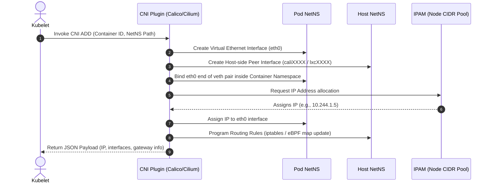

# Kubernetes — Networking Deep Dive

```
Kubernetes Networking Deep Dive
├── Fundamental Rules (3 guarantees)
│   ├── Every pod gets its own IP — no port sharing between pods on same node
│   ├── All pods can reach all pods without NAT — universally routable pod IPs
│   └── Node agents can reach all pods on their node
├── CNI (Container Network Interface)
│   ├── Called by kubelet on pod creation
│   ├── Creates veth pair — one end in pod namespace (eth0), one on host (cali.xxx)
│   ├── Assigns IP from node's pod CIDR
│   └── Programs routing rules (iptables or eBPF)
├── CNI Comparison
│   ├── Flannel — VXLAN overlay; iptables; simplest; NO NetworkPolicy support
│   ├── Calico — BGP direct routing or VXLAN; iptables/eBPF; full NetworkPolicy
│   ├── Cilium — eBPF only; L7 NetworkPolicy; replaces kube-proxy; Hubble observability
│   └── Weave — VXLAN mesh; simple auto-discovery; slower than Calico
├── Services — Stable Network Identity
│   ├── ClusterIP — virtual IP; kube-proxy DNAT to pod IP; internal only
│   ├── NodePort — ClusterIP + port on every node (30000-32767)
│   ├── LoadBalancer — NodePort + cloud LB with external IP
│   └── ExternalName — DNS CNAME alias; no proxying
├── Ingress — L7 HTTP Routing
│   ├── Ingress object — routing rules (host-based, path-based, TLS)
│   ├── Ingress Controller — nginx/Traefik/AWS ALB programs actual reverse proxy
│   ├── Single cloud LB → Ingress Controller → many backend Services
│   └── IngressClass — selects which controller handles which Ingress
├── DNS (CoreDNS)
│   ├── Runs as Deployment in kube-system
│   ├── FQDN: <svc>.<ns>.svc.cluster.local
│   ├── Same namespace: just <svc> (search domain appended)
│   ├── ndots:5 — 5 search-domain lookups before external resolution
│   └── Reduce DNS overhead: set ndots: 2 in pod dnsConfig
└── NetworkPolicy — Pod-Level Firewall
    ├── Default: all pods can communicate with all pods (open by default)
    ├── NetworkPolicy = whitelist model (additive allow rules)
    ├── Requires NetworkPolicy-capable CNI (Calico/Cilium/Weave — NOT Flannel)
    ├── Pattern: default-deny-all → allow selectively
    └── Must allow DNS egress (UDP:53 to kube-system) even in deny-all namespaces
```

## First Principles

- Every pod needs a unique IP to communicate without NAT — the **CNI plugin** provisions this by creating a veth pair, assigning an IP from the node's CIDR, and programming routes.
- Pods are ephemeral and change IPs — **Services** provide a stable virtual IP (ClusterIP) and DNS name; kube-proxy (or Cilium) handles the DNAT translation to healthy pod IPs.
- External traffic needs a single entry point — **Ingress** with one cloud load balancer routes HTTP traffic to many backend Services by host/path, eliminating the need for one LB per Service.
- By default all pods can talk to all pods — **NetworkPolicy** flips this to a whitelist model, but only if the CNI enforces it (Flannel does not); the CNI choice is a security architecture decision, not just a networking one.

## The Kubernetes Networking Model

K8s enforces three fundamental rules:
1. **Every pod gets its own IP** (no port sharing between pods on same node)
2. **All pods can communicate with all other pods without NAT**
3. **Agents on a node can communicate with all pods on that node**

This is implemented by the **CNI (Container Network Interface)** plugin.

***

## CNI Plugin Internals

```
Pod Created by kubelet
        │
        │ kubelet calls CNI binary
        ▼
    CNI Plugin (Calico / Cilium / Flannel)
        │
        ├── Creates virtual ethernet pair (veth)
        │   ├── One end in the pod namespace (eth0)
        │   └── One end in the host namespace (cali.xxxxx)
        │
        ├── Assigns IP from the node's pod CIDR
        │
        └── Programs routing rules (iptables or eBPF)
                Pod A (10.244.1.5) → Pod B (10.244.2.7)
                  └── Node A routes to Node B via overlay or direct routing
```



### CNI Comparison

| CNI | Routing | Data Plane | Key Feature |
|:---|:---|:---|:---|
| **Flannel** | VXLAN overlay | iptables | Simplest, no network policy |
| **Calico** | BGP (direct) or VXLAN | iptables / eBPF | Full NetworkPolicy, high performance |
| **Cilium** | eBPF | eBPF only | L7 network policy, Hubble observability, Envoy integration |
| **Weave** | VXLAN | iptables | Simple, auto-discovery |

***

## Services — The Stable Network Identity

Pods are ephemeral (IPs change on restart). Services provide a stable virtual IP (ClusterIP) that load-balances to healthy pod endpoints.

```
Client Pod
    │
    │  Sends to Service IP: 10.96.45.12:80
    ▼
kube-proxy (or Cilium) intercepts the packet
    │  DNAT: 10.96.45.12:80 → Pod IP: 10.244.2.7:8080
    ▼
Target Pod
```

### Service Types

```yaml
# ClusterIP (default) — internal only
apiVersion: v1
kind: Service
metadata:
  name: my-api
spec:
  selector:
    app: my-api
  ports:
    - port: 80
      targetPort: 8080
  type: ClusterIP

# NodePort — exposes on every node's IP at a static port
  type: NodePort
  # ports.nodePort: 30080  (30000-32767)

# LoadBalancer — provisions a cloud LB (ELB/ALB)
  type: LoadBalancer
  # annotations for AWS, GCP, Azure specific behavior

# ExternalName — DNS alias (no proxying)
  type: ExternalName
  externalName: my-database.us-east-1.rds.amazonaws.com
```

***

## Ingress — L7 HTTP Routing

```
External Traffic
    │
    ▼
LoadBalancer Service (one cloud LB for all services!)
    │
    ▼
Ingress Controller (nginx / traefik / AWS ALB)
    │
    ├── Host: api.company.com → Service: api-service:80
    ├── Host: app.company.com → Service: frontend-service:80
    └── Path: /admin          → Service: admin-service:8080
```

```yaml
apiVersion: networking.k8s.io/v1
kind: Ingress
metadata:
  name: my-ingress
  annotations:
    nginx.ingress.kubernetes.io/rewrite-target: /
    cert-manager.io/cluster-issuer: letsencrypt-prod
spec:
  ingressClassName: nginx
  tls:
    - hosts:
        - api.company.com
      secretName: api-tls-cert
  rules:
    - host: api.company.com
      http:
        paths:
          - path: /v1
            pathType: Prefix
            backend:
              service:
                name: api-v1-service
                port:
                  number: 80
```

***

## NetworkPolicy — Kubernetes Firewall

**By default, all pods can communicate with all other pods.** NetworkPolicy changes this to a whitelist model. **Requires a CNI that supports it (Calico, Cilium, Weave).**

```yaml
# Allow: only pods with label app=frontend can call app=backend on port 8080
# Deny: everything else to app=backend
apiVersion: networking.k8s.io/v1
kind: NetworkPolicy
metadata:
  name: allow-frontend-to-backend
  namespace: production
spec:
  podSelector:
    matchLabels:
      app: backend
  policyTypes:
    - Ingress
    - Egress
  ingress:
    - from:
        - podSelector:
            matchLabels:
              app: frontend
        - namespaceSelector:
            matchLabels:
              env: production
      ports:
        - protocol: TCP
          port: 8080
  egress:
    - to:
        - podSelector:
            matchLabels:
              app: postgres
      ports:
        - protocol: TCP
          port: 5432
    - to:          # Allow DNS
        - namespaceSelector: {}
      ports:
        - protocol: UDP
          port: 53
```

***

## DNS in Kubernetes — CoreDNS

```
Pod does: curl http://my-api
              │
              │ Pod resolves: my-api.production.svc.cluster.local
              ▼
        CoreDNS (kube-dns service: 10.96.0.10)
              │
              │ Returns ClusterIP for my-api Service
              ▼
        kube-proxy translates ClusterIP → Pod IP
```

**FQDN Format:** `<service>.<namespace>.svc.<cluster-domain>`

***

## Logic & Trickiness Table

| Concept | Common Mistake | Senior Understanding |
|:---|:---|:---|
| **kube-proxy modes** | Assume iptables always | `ipvs` mode scales better; Cilium replaces kube-proxy entirely with eBPF |
| **NetworkPolicy** | Think it's enforced by default | Requires a NetworkPolicy-capable CNI; CNIs like Flannel ignore policies |
| **Service DNS** | Use IP addresses | Always use DNS names; IPs change after svc delete/recreate |
| **Ingress vs Gateway API** | Use only Ingress | Gateway API is the future — supports L4+L7, multi-team tenancy |
| **LoadBalancer cost** | One LB per service | Use a single Ingress controller with one LB for all HTTP services |
| **MTU** | Ignore it | VXLAN adds 50 bytes overhead; set CNI MTU to 1450 on 1500 networks |

## System Design Perspective

- **CNI choice is a long-term architectural commitment:** Migrating CNI plugins on a running cluster (e.g., Flannel to Cilium) requires draining all nodes and replacing the CNI binary — effectively a cluster rebuild. Evaluate NetworkPolicy requirements, eBPF support, and L7 observability needs before the first node is provisioned. Flannel is appropriate only for development clusters.
- **iptables scaling cliff:** Each Service adds rules to the `KUBE-SERVICES` chain. At ~10,000 rules (roughly 1000 Services), iptables rule evaluation creates measurable packet processing latency and CPU overhead on every node. Switch to IPVS mode (hash table, O(1)) or Cilium with kube-proxy replacement before hitting this limit. Monitor `iptables -L -n | wc -l` as a leading indicator.
- **LoadBalancer per Service is an anti-pattern at scale:** Each `type: LoadBalancer` Service provisions a cloud load balancer with its own hourly cost, IP address, and DNS name. 100 services = 100 load balancers, 100 IPs to manage, 100 TLS certificates to rotate. A single Ingress controller with one LB and cert-manager (Let's Encrypt) serves all HTTP services. Use LoadBalancer type only for non-HTTP (TCP/UDP) services that Ingress cannot route.
- **ndots:5 is a DNS performance tax:** The default `ndots: 5` in pod `/etc/resolv.conf` means a query for `api.example.com` triggers 5 failed search-domain lookups (`api.example.com.namespace.svc.cluster.local`, etc.) before resolving externally. At high RPS, this multiplies DNS query volume by 6x. Set `ndots: 2` for pods that primarily query external DNS, or use fully-qualified names with trailing dots (`api.example.com.`).
- **Gateway API as a multi-team contract:** Ingress gives all route configuration to whoever can write Ingress objects in any namespace — there's no ownership boundary. Gateway API separates concerns: the platform team owns `GatewayClass` (implementation) and `Gateway` (IP + port + TLS), while application teams own `HTTPRoute` (path rules). This role separation makes the routing layer auditable and prevents teams from accidentally overriding each other's routes.
