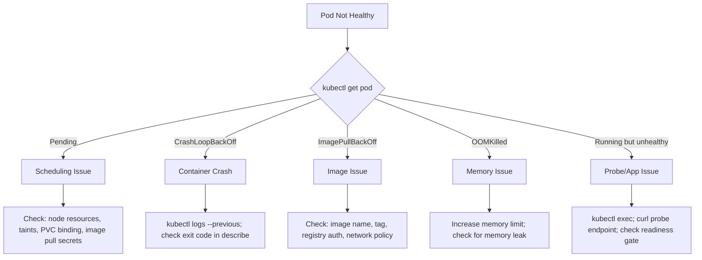

# Kubernetes Troubleshooting Runbooks

> [!IMPORTANT]
> Start every investigation with: `kubectl get events --sort-by='.lastTimestamp' -n <namespace>` and `kubectl describe pod <pod>`. 80% of issues are surfaced here.

## Decision Tree



## Runbook 1: Pod Stuck in Pending

**Symptoms**: Pod shows `STATUS: Pending` for more than 30 seconds.

**Diagnostic steps**:
```bash
kubectl describe pod <pod> -n <namespace>
# Look for: "Events:" section at bottom
# Common messages:
# "0/3 nodes are available: 3 Insufficient cpu" → resource exhaustion
# "0/3 nodes are available: 3 node(s) had taint..." → taint mismatch
# "0/3 nodes are available: 3 pod has unbound immediate PersistentVolumeClaims" → PVC issue
# "no nodes available to schedule pods" → all nodes cordoned/not ready
```

**Resolution by cause**:

| Event Message | Cause | Fix |
|---|---|---|
| Insufficient cpu/memory | Nodes full | Add nodes, reduce requests, or scale down other workloads |
| Unbound PVC | No matching PV | Check StorageClass, check PV capacity and access mode |
| node had taint | Missing toleration | Add toleration to pod spec or remove taint from node |
| didn't match pod affinity | Affinity too strict | Relax affinity or add `preferredDuringScheduling` |
| Exceeded max pod quota | ResourceQuota | Increase quota or reduce pod count |

```bash
# Check node capacity
kubectl describe node <node> | grep -A 20 "Allocated resources"

# Check PVC status
kubectl get pvc -n <namespace>
kubectl describe pvc <pvc-name> -n <namespace>

# Check resource quotas
kubectl get resourcequota -n <namespace> -o yaml
```

***

## Runbook 2: CrashLoopBackOff

**Symptoms**: Pod keeps restarting, STATUS shows `CrashLoopBackOff`.

**Diagnostic steps**:
```bash
# Step 1: Get exit reason
kubectl describe pod <pod> -n <ns> | grep -A 10 "Last State"
# Exit code 137 = OOMKilled (SIGKILL from kernel)
# Exit code 1 = application error
# Exit code 143 = SIGTERM (graceful shutdown requested but app exited non-zero)
# Exit code 2 = misuse of shell built-ins (often script error)

# Step 2: Get last run's logs
kubectl logs <pod> -c <container> --previous -n <ns>

# Step 3: If no logs, override entrypoint
kubectl debug pod/<pod> --copy-to=<pod>-debug --container=<container> -it -- /bin/sh
```

**Common causes**:
- Application error on startup (bad config, missing env var, can't connect to DB)
- OOMKill (check `Exit Code: 137`; increase memory limit)
- Liveness probe too aggressive (killing healthy-but-slow startup; use `startupProbe`)
- Missing required files/secrets not mounted
- Permission denied (check `securityContext.runAsUser` vs file ownership)

***

## Runbook 3: ImagePullBackOff / ErrImagePull

**Symptoms**: Pod shows `ImagePullBackOff` or `ErrImagePull`.

```bash
kubectl describe pod <pod> | grep -A 5 "Events"
# Messages like:
# "Failed to pull image: rpc error... unauthorized: authentication required"
# "Failed to pull image: rpc error... not found"
# "context deadline exceeded" (network issue)
```

**Resolution by cause**:

```bash
# Wrong image name/tag → fix the image reference in deployment

# Auth failure (private registry):
kubectl create secret docker-registry regcred \
  --docker-server=<registry> \
  --docker-username=<user> \
  --docker-password=<token>
# Then add to pod spec:
# imagePullSecrets:
# - name: regcred

# Network policy blocking egress to registry:
# Check CNI policies; ensure egress to registry IP is allowed

# Rate limiting (Docker Hub):
# Use authenticated pulls or switch to ECR/GCR/ACR mirror

# Image doesn't exist:
docker pull <image>  # verify locally first
```

***

## Runbook 4: Service Not Reachable

**Symptoms**: Pods are running but curl to Service IP/DNS fails.

```bash
# Step 1: Verify service exists and has endpoints
kubectl get svc <service> -n <ns>
kubectl get endpoints <service> -n <ns>
# If endpoints is empty → selector mismatch

# Step 2: Check selector matches pod labels
kubectl get pod <pod> --show-labels
kubectl get svc <service> -o jsonpath='{.spec.selector}'

# Step 3: Test DNS resolution from inside cluster
kubectl run dnstest --image=busybox --rm -it --restart=Never -- \
  nslookup <service>.<namespace>.svc.cluster.local

# Step 4: Test direct pod-to-pod connectivity
kubectl exec -it <pod> -- curl http://<pod-ip>:<port>

# Step 5: Test pod-to-service
kubectl exec -it <pod> -- curl http://<service>.<ns>.svc.cluster.local:<port>

# Step 6: Check NetworkPolicy
kubectl get networkpolicy -n <ns>
```

**Common causes**:
- Selector mismatch (service selects `app: web` but pod has `app: webapp`)
- Wrong port in Service spec (targetPort doesn't match containerPort)
- NetworkPolicy blocking traffic
- kube-proxy rules not synced (check `kubectl -n kube-system logs -l k8s-app=kube-proxy`)
- Pod not ready (readiness probe failing → removed from endpoints)

***

## Runbook 5: OOMKilled

**Symptoms**: Pod restarts with `OOMKilled` in Last State, exit code 137.

```bash
# Confirm OOMKill
kubectl describe pod <pod> | grep -A 5 "Last State"
# "Reason: OOMKilled"

# Check current memory usage trend
kubectl top pod <pod> --containers

# Check what the limit is
kubectl get pod <pod> -o jsonpath='{.spec.containers[*].resources}'
```

**Resolution**:
1. **Immediate**: Increase memory limit in Deployment spec
2. **Diagnose leak**: Enable heap profiling in your app; use `kubectl exec` to run memory profiler
3. **Long-term**: Install VPA to get recommendations; set limit to ~2× observed peak
4. **If it's a Java app**: Set `-Xmx` to 75% of container memory limit; add `-XX:+ExitOnOutOfMemoryError` so OOMKill is explicit

```yaml
resources:
  requests:
    memory: "512Mi"
  limits:
    memory: "1Gi"  # increased from previous value
```

***

## Runbook 6: PVC Stuck in Pending

**Symptoms**: `kubectl get pvc` shows `STATUS: Pending`.

```bash
kubectl describe pvc <pvc-name> -n <ns>
# Look for: ProvisioningFailed, no persistent volumes available,
# volume.kubernetes.io/storage-provisioner annotation
```

**Causes and fixes**:

| Cause | Fix |
|---|---|
| No StorageClass with that name | `kubectl get sc` — check StorageClass exists |
| StorageClass provisioner not installed | Deploy the CSI driver for that storage type |
| Requested size exceeds available PV | Create a larger PV or use dynamic provisioning |
| Access mode mismatch | PV has RWO but PVC requests RWX |
| `volumeBindingMode: WaitForFirstConsumer` | PVC binds only when a Pod is scheduled — check if pod is also pending |
| Wrong `storageClassName` | Fix the PVC spec |

***

## Runbook 7: Node Not Ready

**Symptoms**: `kubectl get nodes` shows `STATUS: NotReady`.

```bash
# Step 1: Describe the node
kubectl describe node <node> | grep -A 20 "Conditions:"

# Step 2: Get kubelet logs (need node access or debug pod)
kubectl debug node/<node> -it --image=ubuntu -- chroot /host \
  journalctl -u kubelet --no-pager -n 100

# Step 3: Check node events
kubectl get events --field-selector involvedObject.name=<node> -A
```

**Common causes**:
- Kubelet stopped: restart with `systemctl restart kubelet`
- Network plugin (CNI) crashed: check DaemonSet pods in `kube-system`
- Disk pressure: clean up disk space on node
- Memory pressure: identify and kill rogue processes
- Certificate expired: renew kubelet serving certificate
- Node lost network connectivity to API server

***

## Runbook 8: Ingress 502/504 Bad Gateway

**Symptoms**: HTTP 502 or 504 errors from Ingress.

```bash
# Step 1: Check Ingress controller pods
kubectl get pods -n ingress-nginx  # or traefik, etc.
kubectl logs -n ingress-nginx -l app.kubernetes.io/component=controller --tail=100

# Step 2: Check Ingress resource
kubectl describe ingress <name> -n <ns>
# Look for: Default backend, TLS config, rules

# Step 3: Verify backend service endpoints
kubectl get endpoints <backend-service> -n <ns>

# Step 4: Test backend directly
kubectl exec -n ingress-nginx <controller-pod> -- curl -v http://<service>.<ns>.svc.cluster.local:<port>
```

**Common causes**:
- 502: Backend pods not ready (readiness probe failing)
- 502: Backend port mismatch
- 504: Backend too slow (increase `nginx.ingress.kubernetes.io/proxy-read-timeout`)
- SSL termination misconfigured
- Missing `ingressClassName` (1.18+)

***

## Runbook 9: Namespace Stuck in Terminating

**Symptoms**: `kubectl delete namespace <ns>` hangs; namespace shows `Terminating` state.

```bash
# Check what's blocking deletion
kubectl get all -n <ns>
kubectl api-resources --verbs=list --namespaced -o name | \
  xargs -n1 kubectl get --show-kind --ignore-not-found -n <ns>

# Find resources with finalizers
kubectl get <resource> -n <ns> -o json | jq '.items[] | select(.metadata.finalizers != null) | .metadata.name'
```

**Fix**:
```bash
# Option 1: Fix the controller that owns the finalizer (preferred)
# If an operator/controller is gone, remove the finalizer manually:
kubectl patch <resource> <name> -n <ns> -p '{"metadata":{"finalizers":[]}}' --type=merge

# Option 2: Force namespace deletion via API (last resort)
kubectl get namespace <ns> -o json | \
  jq '.spec.finalizers = []' | \
  kubectl replace --raw "/api/v1/namespaces/<ns>/finalize" -f -
```

> [!CAUTION]
> Force-removing finalizers may leak external resources. Fix the underlying controller first.

***

## Runbook 10: HPA Not Scaling

**Symptoms**: Pods are clearly overloaded but HPA doesn't add replicas.

```bash
kubectl describe hpa <name> -n <ns>
# Check: "Conditions" section
# "ScalingActive False" → can't get metrics
# "AbleToScale False" → already at max, or backoff
# Check "Current/Target" values in metrics section
```

**Common causes**:
```bash
# metrics-server not installed
kubectl top pods  # if this fails, metrics-server is missing

# Check metrics-server
kubectl get pods -n kube-system -l k8s-app=metrics-server
kubectl logs -n kube-system -l k8s-app=metrics-server

# HPA v2 with custom metrics — check adapter
kubectl get apiservices | grep metrics

# Pod has no resource requests set (HPA needs requests to calculate % utilization)
kubectl get pod <pod> -o jsonpath='{.spec.containers[*].resources.requests}'
```

***

## Runbook 11: etcd Issues

**Symptoms**: API server slow or returning errors, `kubectl` commands timing out.

```bash
# Check etcd pod health
kubectl get pods -n kube-system -l component=etcd

# Check etcd logs
kubectl logs -n kube-system etcd-<master-node> --tail=100

# Check etcd metrics (from control plane node)
ETCDCTL_API=3 etcdctl endpoint health \
  --endpoints=https://127.0.0.1:2379 \
  --cacert=/etc/kubernetes/pki/etcd/ca.crt \
  --cert=/etc/kubernetes/pki/etcd/server.crt \
  --key=/etc/kubernetes/pki/etcd/server.key

# Check DB size (>8GB causes performance issues; default quota is 2GB)
ETCDCTL_API=3 etcdctl endpoint status \
  --endpoints=https://127.0.0.1:2379 \
  --cacert=/etc/kubernetes/pki/etcd/ca.crt \
  --cert=/etc/kubernetes/pki/etcd/server.crt \
  --key=/etc/kubernetes/pki/etcd/server.key \
  --write-out=table
```

**If etcd DB is too large**:
```bash
# Compact and defragment
ETCDCTL_API=3 etcdctl compact $(ETCDCTL_API=3 etcdctl endpoint status --write-out json | jq '.[0].Status.header.revision')
ETCDCTL_API=3 etcdctl defrag --endpoints=https://127.0.0.1:2379 ...
```

***

## Runbook 12: DNS Resolution Failing

**Symptoms**: Service discovery broken; `nslookup kubernetes.default` fails.

```bash
# Step 1: Check CoreDNS pods
kubectl get pods -n kube-system -l k8s-app=kube-dns
kubectl logs -n kube-system -l k8s-app=kube-dns

# Step 2: Test from a pod
kubectl run dnstest --image=busybox --rm -it --restart=Never -- sh
# In the shell:
nslookup kubernetes.default
nslookup google.com  # test external DNS
cat /etc/resolv.conf  # check ndots and search domains

# Step 3: Check CoreDNS ConfigMap
kubectl get cm coredns -n kube-system -o yaml

# Step 4: Check NetworkPolicy isn't blocking DNS (port 53 UDP/TCP to kube-system)
kubectl get networkpolicy -n <pod-namespace>
```

**Common fixes**:
- CoreDNS crashlooping: check resource limits, common with high query volumes
- NetworkPolicy blocking port 53 egress to kube-system
- CoreDNS config loop plugin conflicting with upstream
- ndots: 5 causing excessive NXDOMAIN lookups (use FQDN with trailing dot)

***

## Runbook 13: Rolling Update Stuck

**Symptoms**: `kubectl rollout status deployment/<name>` hangs at "Waiting for rollout to finish".

```bash
kubectl rollout status deployment/<name> -n <ns>
kubectl describe deployment <name> -n <ns>
# Look at: "Conditions" section, new RS replica count vs desired

# Check new ReplicaSet pods
kubectl get rs -n <ns>
kubectl get pods -n <ns> -l <selector>  # check new pods' status
```

**Common causes**:
- New pods crashlooping (fix the app issue, then rollout proceeds or undo)
- Readiness probe not passing (new pods never become Ready)
- `minReadySeconds` set high
- `maxUnavailable: 0` and `maxSurge: 0` (invalid config — won't make progress)
- PodDisruptionBudget blocking old pod termination

```bash
# Rollback if needed
kubectl rollout undo deployment/<name>

# Set a rollout deadline
kubectl patch deployment <name> -p '{"spec":{"progressDeadlineSeconds":300}}'
```

***

## Runbook 14: Certificate Expiry

**Symptoms**: API server unreachable; `kubectl` returns x509 certificate errors.

```bash
# Check all cert expiry dates (kubeadm)
kubeadm certs check-expiration

# Check a specific cert manually
openssl x509 -in /etc/kubernetes/pki/apiserver.crt -noout -text | grep -A 2 "Validity"
```

**Renewal**:
```bash
# Renew all certificates (run on control plane node)
kubeadm certs renew all

# Update kubeconfig after renewal
cp /etc/kubernetes/admin.conf ~/.kube/config

# Static pods restart automatically when certs change
# For non-static components, restart manually:
kubectl -n kube-system rollout restart daemonset/kube-proxy
```

> [!CAUTION]
> Schedule certificate renewal at least 30 days before expiry. Set up monitoring: `openssl x509 -in /etc/kubernetes/pki/apiserver.crt -noout -enddate` in a cron job or Prometheus alert.

***

## Runbook 15: ArgoCD App OutOfSync Loop

**Symptoms**: ArgoCD shows app perpetually OutOfSync even after successful sync.

```bash
# Check what ArgoCD thinks is different
argocd app diff <app-name>

# Check sync status details
argocd app get <app-name> --refresh
```

**Common causes**:
- Controller or webhook is mutating objects after sync (admission webhooks adding annotations)
- HPA changing `replicas` field (use `ignoreDifferences` in ArgoCD Application)
- Helm chart generating non-deterministic output
- ArgoCD tracking the wrong branch/path

```yaml
# ignoreDifferences for HPA-managed replicas
spec:
  ignoreDifferences:
  - group: apps
    kind: Deployment
    jsonPointers:
    - /spec/replicas
  - group: autoscaling
    kind: HorizontalPodAutoscaler
    jqPathExpressions:
    - .spec.metrics[] | select(.type == "ContainerResource")
```

***

## Quick Reference: Exit Codes

| Exit Code | Signal | Meaning |
|-----------|--------|---------|
| 0 | — | Success |
| 1 | — | General application error |
| 2 | — | Script/shell error |
| 125 | — | Docker/runtime error |
| 126 | — | Command not executable |
| 127 | — | Command not found |
| 130 | SIGINT | Ctrl+C (keyboard interrupt) |
| 137 | SIGKILL | OOMKilled or force-killed |
| 139 | SIGSEGV | Segmentation fault |
| 143 | SIGTERM | Graceful termination requested |

## Quick Reference: API Server Audit

```bash
# Check API deprecation warnings in current cluster
kubectl get --raw /metrics | grep apiserver_requested_deprecated_apis

# Find resources using deprecated API versions
kubectl api-resources --verbs=list -o name | \
  xargs -n1 -I{} kubectl get {} --all-namespaces --ignore-not-found -o json 2>/dev/null | \
  jq -r '.items[]? | "\(.apiVersion) \(.kind) \(.metadata.namespace)/\(.metadata.name)"'
```
