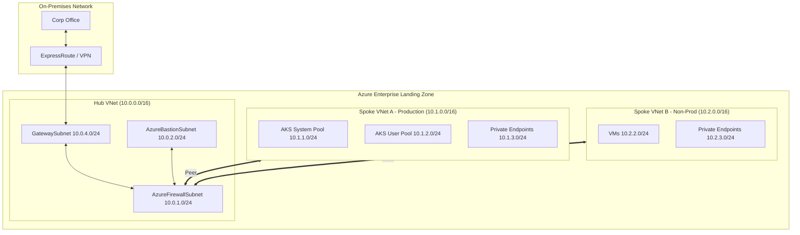

# Azure Networking — Deep Dive

```
Azure Networking
├── VNet Architecture & Subnetting
│   ├── VNet: isolated network, RFC 1918 CIDR, region-scoped
│   ├── Subnets: divide VNet, NSG per subnet, service endpoints
│   ├── Enterprise hub-spoke address design (10.x.x.x hierarchy)
│   ├── Subnet sizing (reserve 5 IPs per subnet for Azure)
│   └── App Service VNet Integration (delegated subnet /28 minimum)
├── VNet Peering & Transit
│   ├── Regional peering (same region, low latency, backbone)
│   ├── Global peering (cross-region, higher cost)
│   ├── Non-transitive by default (A↔B, B↔C does NOT mean A↔C)
│   ├── Azure Route Server (BGP-based transit through NVA)
│   └── UDRs (user-defined routes to force traffic through hub firewall)
├── Private Endpoints & Private Link
│   ├── Private Endpoint: NIC in your subnet with private IP for PaaS service
│   ├── Supported services: Storage, SQL, KV, ACR, AKS API, Service Bus, etc.
│   ├── DNS: private DNS zone (e.g., privatelink.blob.core.windows.net) linked to VNet
│   ├── Private Link Service: expose your own service via PrivateLink
│   └── Disable public network access after PE creation
├── Azure DNS Architecture
│   ├── Azure DNS zones (public): authoritative DNS, hosted in Azure
│   ├── Private DNS zones: internal resolution within VNet
│   ├── Multi-region DNS design: one private zone, link to all VNets
│   ├── Private DNS Resolver: inbound (on-prem → Azure) + outbound (Azure → on-prem)
│   └── Forwarding rules (resolve on-prem domains from Azure resources)
├── Network Security & NSGs
│   ├── NSG: stateful packet filter at NIC or subnet level
│   ├── Rule priority (100–4096, lower = higher priority)
│   ├── Default rules: AllowVnetInBound, AllowAzureLoadBalancer, DenyAllInBound
│   ├── Service Tags (AzureLoadBalancer, Internet, VirtualNetwork, Storage)
│   ├── ASG (Application Security Groups): group NICs, reference in NSG rules
│   └── VPC Flow Logs → Log Analytics → traffic analysis
├── Azure Firewall & NVA
│   ├── Azure Firewall: managed, stateful, auto-scaling, FQDN filtering
│   ├── SKUs: Basic / Standard / Premium (IDPS only in Premium)
│   ├── Network rules (IP+port), Application rules (FQDN), NAT rules (DNAT)
│   ├── Forced tunneling (default route 0.0.0.0/0 → Firewall)
│   └── NVA (3rd party): Palo Alto, Fortinet — higher flexibility, more ops burden
├── Load Balancing
│   ├── Azure Load Balancer (L4, regional, SKU: Basic vs Standard)
│   ├── Application Gateway v2 (L7, WAF, path-based routing, autoscaling)
│   ├── Azure Front Door (global CDN + WAF + health probe failover)
│   ├── Traffic Manager (DNS-based, global load balancing, no data-plane)
│   └── Decision: Internet-facing global → FD; Regional L7 → App GW; L4 internal → ALB
├── Hybrid Connectivity
│   ├── VPN Gateway (IPSec/IKE, up to 10 Gbps, internet-based)
│   ├── ExpressRoute (dedicated circuit, up to 100 Gbps, SLA)
│   ├── Gateway Transit (peered VNets share VPN/ER gateway)
│   └── ExpressRoute + VPN coexistence (failover)
├── AKS Networking Patterns
│   ├── Azure CNI (VNet IPs, no overlay, SG per pod possible)
│   ├── Azure CNI Overlay (private pod CIDR, better IP conservation)
│   ├── Private AKS cluster (private API server, requires private DNS)
│   ├── Egress: NAT Gateway (fixed IP) vs Azure Firewall (FQDN rules)
│   └── Ingress: AGIC (native, WAF) vs nginx (community, more control)
└── Troubleshooting
    ├── Network Watcher: Connection Monitor, IP Flow Verify, Packet Capture
    ├── DNS: nslookup + dig from within pod/VM (check private zone link)
    ├── Common issues: NSG blocking, missing private DNS link, PE not approved
    └── Key Gotchas: NAT GW needs public IP; PE and service endpoint on same subnet causes issues
```

## First Principles

Compute needs identity (AAD), network isolation (VNet), storage, and managed services. AKS = Kubernetes control plane managed by Azure. Azure DevOps = hosted CI/CD. Azure Policy = guardrails enforced at API level. Cost comes from consumption — control it with budgets and tagging.

## Table of Contents

1. [VNet Architecture & Subnetting](#1-vnet-architecture--subnetting)
2. [VNet Peering & Transit](#2-vnet-peering--transit)
3. [Private Endpoints & Private Link](#3-private-endpoints--private-link)
4. [Azure DNS Architecture](#4-azure-dns-architecture)
5. [Network Security & NSGs](#5-network-security--nsgs)
6. [Azure Firewall & NVA](#6-azure-firewall--nva)
7. [Load Balancing — ALB vs Front Door](#7-load-balancing--alb-vs-front-door)
8. [Hybrid Connectivity](#8-hybrid-connectivity)
9. [AKS Networking Patterns](#9-aks-networking-patterns)
10. [Troubleshooting & Diagnostics](#10-troubleshooting--diagnostics)

***

## 1. VNet Architecture & Subnetting

### VNet Address Space Design

```
Enterprise VNet Design (Hub-and-Spoke)

Hub VNet: 10.0.0.0/16
├── 10.0.1.0/24 — Azure Firewall subnet
├── 10.0.2.0/24 — Azure Bastion subnet (AzureBastionSubnet)
├── 10.0.3.0/24 — Application Gateway subnet
├── 10.0.4.0/24 — GatewaySubnet (VPN/ExpressRoute)
└── 10.0.5.0/24 — Azure Route Server

Spoke VNet A (Production): 10.1.0.0/16
├── 10.1.1.0/24 — AKS nodes (system pool)
├── 10.1.2.0/24 — AKS nodes (user pool)
├── 10.1.3.0/24 — Private Endpoints
└── 10.1.4.0/24 — Jump boxes / bastion targets

Spoke VNet B (Non-Prod): 10.2.0.0/16
├── 10.2.1.0/24 — App Service VNet Integration
├── 10.2.2.0/24 — VMs
└── 10.2.3.0/24 — Private Endpoints
```



**Subnet Sizing Guidelines:**
| Workload | Minimum CIDR | Recommended |
|----------|--------------|-------------|
| AKS node pool | /27 (32 IPs) | /24 (256 IPs) |
| App Service VNet Integration | /27 | /24 |
| Private Endpoints | /28 | /24 (consolidated) |
| Azure Firewall | /26 | /24 |
| Azure Bastion | /27 | /26 |
| Application Gateway | /27 | /24 |
| GatewaySubnet | /27 | /24 |

**IP Reservation Rules:**
- Azure reserves the first 4 IPs and last 1 IP in every subnet
- For a /24 subnet (256 IPs), only 251 are usable
- Plan for 20-30% growth — subnets cannot be resized

### VNet Integration Patterns

**App Service VNet Integration:**
```bash
# Requires dedicated subnet (cannot be shared with other resources)
az webapp vnet-integration add \
  --name myapp \
  --resource-group myRG \
  --vnet myVNet \
  --subnet app-service-subnet

# App Service can now access:
# - Resources in the VNet (VMs, Private Endpoints)
# - On-premises via VPN/ExpressRoute
# - Other peered VNets
```

**Requirements:**
- Dedicated subnet (not shared with other resources)
- /27 minimum (32 IPs) — Azure uses 5 IPs
- NSG on integration subnet should allow all outbound (App Service manages security)
- Service endpoints NOT required for PaaS access (integration provides private routing)

***

## 2. VNet Peering & Transit

### Peering Types

```
VNet A (10.0.0.0/16) <──────> VNet B (10.1.0.0/16)
         │                           │
         │ Regional Peering          │ Global Peering
         │ (same region)             │ (cross-region)
         │ Latency: <1ms             │ Latency: varies
         │ Cost: $0.01/GB            │ Cost: $0.02/GB
```

**Peering Properties:**
| Property | Value |
|----------|-------|
| Latency | Same as within VNet (private backbone) |
| Bandwidth | Up to 100 Gbps (depends on VM size) |
| Transit | NOT supported by default (need UDRs or Azure Route Server) |
| Overlapping IPs | Not allowed — must use different address spaces |

### Hub-and-Spoke with Transit

```
                    Internet
                       │
                       ▼
                 ┌─────────────┐
                 │   Hub VNet  │
                 │ 10.0.0.0/16 │
                 │ ┌─────────┐ │
                 │ │ Firewall│ │
                 │ └────┬────┘ │
                 └──────┼──────┘
                        │
        ┌───────────────┼───────────────┐
        │               │               │
        ▼               ▼               ▼
  ┌──────────┐   ┌──────────┐   ┌──────────┐
  │ Spoke A  │   │ Spoke B  │   │ Spoke C  │
  │10.1.0.0/16│   │10.2.0.0/16│   │10.3.0.0/16│
  └──────────┘   └──────────┘   └──────────┘
```

**Without Transit Routing (default):**
- Spoke A ↔ Spoke B: ❌ Blocked (must go through Hub)
- Spoke A ↔ Hub: ✅ Allowed
- Spoke B ↔ Hub: ✅ Allowed

**With Transit Routing (UDRs):**
```bash
# Create route table for Spoke A
az network route-table create \
  --name spoke-a-udr \
  --resource-group spoke-a-rg

# Route Spoke B traffic through Hub Firewall
az network route-table route create \
  --route-table-name spoke-a-udr \
  --resource-group spoke-a-rg \
  --name ToSpokeB \
  --address-prefix 10.2.0.0/16 \
  --next-hop-type VirtualAppliance \
  --next-hop-ip-address 10.0.0.4  # Azure Firewall IP

# Associate route table with Spoke A subnet
az network vnet subnet update \
  --name app-subnet \
  --vnet-name spoke-a-vnet \
  --resource-group spoke-a-rg \
  --route-table spoke-a-udr
```

**Azure Route Server (BGP-based transit):**
```bash
az network routeserver create \
  --resource-group hub-rg \
  --name myRouteServer \
  --sku Standard \
  --subnet-id /subscriptions/.../route-server-subnet

# Route Server learns routes from Firewall via BGP
# and propagates to all peered spokes automatically
```

***

## 3. Private Endpoints & Private Link

### Private Endpoint Architecture

```
                    Azure PaaS Service (e.g., Storage)
                    ┌─────────────────────────────────┐
                    │  Public Endpoint (disabled)     │
                    │  xxx.blob.core.windows.net      │
                    │         ▲                       │
                    │         │ Private Link          │
                    └─────────┼───────────────────────┘
                              │
                    ┌─────────▼─────────┐
                    │  Private Endpoint │
                    │  10.0.3.45        │
                    │  (NIC in subnet)  │
                    └─────────┬─────────┘
                              │
                    ┌─────────▼─────────┐
                    │  Your VNet/Subnet │
                    │  10.0.3.0/24      │
                    └───────────────────┘
```

**Key Components:**
| Component | Description |
|-----------|-------------|
| **Private Endpoint** | Network interface (NIC) in your VNet with a private IP |
| **Private Link** | The underlying technology connecting PE to PaaS service |
| **Private DNS Zone** | `privatelink.<service>.core.windows.net` — resolves public hostname to private IP |
| **Connection Approval** | Manual or auto-approve for security (prevent unauthorized PE creation) |

### Creating Private Endpoints

```bash
# Create Private Endpoint for Azure Storage
az network private-endpoint create \
  --name pe-storage \
  --resource-group myRG \
  --vnet-name myVNet \
  --subnet private-endpoints \
  --private-connection-resource-id /subscriptions/.../storageAccounts/mystorage \
  --group-id blob \
  --connection-name pe-storage-connection

# Create Private DNS Zone
az network private-dns zone create \
  --resource-group myRG \
  --name "privatelink.blob.core.windows.net"

# Link DNS Zone to VNet (auto-registration NOT needed for PE)
az network private-dns link vnet create \
  --resource-group myRG \
  --name myvnet-link \
  --zone-name "privatelink.blob.core.windows.net" \
  --vnet-name myVNet \
  --registration-enabled false

# Create DNS A record for the PE
az network private-endpoint dns-zone-group create \
  --resource-group myRG \
  --endpoint-name pe-storage \
  --name default \
  --private-dns-zone "privatelink.blob.core.windows.net" \
  --zone-name blob
```

### Private Endpoint DNS Resolution

**Inside VNet (with Private DNS Zone linked):**
```bash
# Query from VM in VNet
nslookup mystorage.blob.core.windows.net
# Returns: 10.0.3.45 (Private Endpoint IP) ✅
```

**Outside VNet (on-premises via ExpressRoute):**
```
On-premises DNS → Conditional Forwarder → Azure Private DNS Resolver → Private DNS Zone
```

**Without proper DNS configuration:**
```bash
# Query from on-premises (no conditional forwarder)
nslookup mystorage.blob.core.windows.net
# Returns: Public IP → Firewall blocks access ❌
```

### Private Link Service (Private Link for your own service)

```
Service Consumer VNet          Service Provider VNet
┌─────────────────────┐        ┌─────────────────────┐
│  Private Endpoint   │        │  Internal Load      │
│  10.1.0.50          │◄──────►│  Balancer           │
│                     │        │  (Private IP)       │
│                     │        │       ▲             │
│                     │        │       │             │
│                     │        │  ┌──┴──┐  ┌──┴──┐  │
│                     │        │  │ VM1 │  │ VM2 │  │
│                     │        │  └─────┘  └─────┘  │
└─────────────────────┘        └─────────────────────┘
```

```bash
# Create Private Link Service behind ILB
az network private-link-service create \
  --name mypls \
  --resource-group provider-rg \
  --vnet-name provider-vnet \
  --lb-name internal-lb \
  --lb-frontend-ip-configs frontend-config

# Consumer creates PE to the PLS
az network private-endpoint create \
  --name pe-consumer \
  --resource-group consumer-rg \
  --private-connection-resource-id /subscriptions/.../privateLinkServices/mypls \
  --group-id generic \
  --vnet-name consumer-vnet \
  --subnet default
```

***

## 4. Azure DNS Architecture

### DNS Resolution Flow

```
VM in VNet queries: mystorage.blob.core.windows.net
│
├── Custom DNS Server (if configured)
│   ├── Can resolve? → Return answer
│   └── Cannot resolve? → Forward to Azure DNS (168.63.129.16)
│
├── Azure DNS (168.63.129.16) — default for VNet
│   ├── Private DNS Zone linked? → Return private IP
│   └── Public zone? → Return public IP
│
└── VM receives answer
```

**Azure DNS Server IP: `168.63.129.16`**
- Virtual IP — not a real resource
- Available in every VNet, every region
- Handles: Private DNS Zones, public Azure service DNS, external DNS

### Private DNS Zone Design

**Scenario: Multi-region AKS with shared PaaS services**

```
Region: East US                          Region: West Europe
┌─────────────────────┐                  ┌─────────────────────┐
│ Hub VNet (East)     │                  │ Hub VNet (West)     │
│ - Azure Firewall    │                  │ - Azure Firewall    │
│ - Private DNS Zone  │◄────Peering────►│ - Private DNS Zone  │
│   (linked)          │                  │   (linked)          │
└─────────────────────┘                  └─────────────────────┘
         │                                        │
         │ Spoke VNet (East)                      │ Spoke VNet (West)
         │ - AKS Cluster                          │ - AKS Cluster
         │ - Private Endpoints                    │ - Private Endpoints
```

**DNS Zone Naming:**
| Service | Private DNS Zone |
|---------|------------------|
| Azure Blob Storage | `privatelink.blob.core.windows.net` |
| Azure SQL Database | `privatelink.database.windows.net` |
| Azure Key Vault | `privatelink.vaultcore.azure.net` |
| Azure Container Registry | `privatelink.azurecr.io` |
| Azure Cosmos DB | `privatelink.documents.azure.com` |

### Azure Private DNS Resolver

**Problem:** On-premises DNS cannot resolve Azure Private DNS Zones

**Solution:** Private DNS Resolver forwards between on-premises and Azure

```
On-premises DNS Server
        │
        │ Conditional Forward:
        │ *.privatelink.*.windows.net → 10.0.5.10
        │
        ▼
┌───────────────────────────────────┐
│  Azure Private DNS Resolver       │
│  Inbound Endpoint: 10.0.5.10      │
│  Outbound Endpoint: 10.0.5.11     │
│                                   │
│  Forwarding Ruleset:              │
│  - privatelink.* → Azure DNS      │
│  - corp.local → On-premises DNS   │
└───────────────────────────────────┘
        │
        │ Linked to Hub VNet
        │
        ▼
  Private DNS Zones resolve
```

```bash
# Create Private DNS Resolver
az network dns-resolver create \
  --resource-group hub-rg \
  --name myResolver \
  --location eastus \
  --sku Standard

# Create Inbound Endpoint (for on-premises to query)
az network dns-resolver inbound-endpoint create \
  --resource-group hub-rg \
  --resolver-name myResolver \
  --name inbound-endpoint \
  --subnet-id /subscriptions/.../subnets/resolver-subnet

# Create Forwarding Ruleset
az network dns-resolver ruleset create \
  --resource-group hub-rg \
  --name myRuleset

# Add forwarding rule for on-premises domain
az network dns-resolver ruleset forwarding-rule create \
  --resource-group hub-rg \
  --ruleset-name myRuleset \
  --name forward-onprem \
  --domain corp.local \
  --forwarding-target-stub 10.100.0.10  # On-premises DNS
```

***

## 5. Network Security & NSGs

### NSG Rule Processing

```
Inbound Traffic
│
├── 1. Check NSG rules (lowest priority first)
│   ├── Security Rule 100: Allow HTTPS from Internet ✅
│   ├── Security Rule 110: Allow SSH from Corporate ✅
│   ├── Security Rule 65000: Deny All Inbound ❌
│   └── Match found → Apply action (stop processing)
│
├── 2. If no NSG rule matches → Default Deny
│
└── 3. If NSG allows → Check UDRs (User Defined Routes)
    └── Route to NVA for inspection? → Forward to NVA
```

**Default NSG Rules (cannot be deleted):**
| Direction | Priority | Name | Source | Destination | Action |
|-----------|----------|------|--------|-------------|--------|
| Inbound | 65000 | DenyAllInBound | Any | Any | Deny |
| Inbound | 65001 | AllowVNetInBound | VNet | VNet | Allow |
| Inbound | 65002 | AllowAzureLoadBalancerInBound | AzureLoadBalancer | Any | Allow |
| Outbound | 65000 | DenyAllOutBound | Any | Any | Deny |
| Outbound | 65001 | AllowVNetOutBound | VNet | VNet | Allow |
| Outbound | 65002 | AllowInternetOutBound | Any | Internet | Allow |

### Service Tags

```bash
# Use service tags instead of individual IPs
az network nsg rule create \
  --nsg-name web-nsg \
  --name AllowAzureCloud \
  --priority 120 \
  --source-address-prefixes AzureCloud.eastus \  # All Azure IPs in region
  --destination-port-ranges 443 \
  --access Allow

# Common service tags:
# - AzureCloud.<region> — All public Azure IPs in region
# - VirtualNetwork — VNet address space + peered VNets
# - Internet — Public IPs (excludes private ranges)
# - AzureLoadBalancer — Azure health probes
# - AzureMonitor — Azure Monitor service IPs
# - Storage.<region> — Azure Storage IPs in region
# - Sql.<region> — Azure SQL IPs in region
```

### NSG Flow Logs

```bash
# Enable NSG Flow Logs (logs all allowed/denied flows)
az network watcher flow-log configure \
  --resource-group myRG \
  --nsg web-nsg \
  --storage-account mystorageacct \
  --enabled true \
  --retention 30 \
  --format-version 2  # Includes 5-tuple + traffic index

# Query in Log Analytics
AzureNetworkAnalytics_CL
| where TrafficIndex_s == "443"
| where FlowDirection_s == "I"  # Inbound
| summarize count() by IPAddress_s, Allowed_s
```

***

## 6. Azure Firewall & NVA

### Azure Firewall Architecture

```
                    Internet
                       │
                       ▼
              ┌────────────────┐
              │  Public IP(s)  │
              │  (1 or more)   │
              └───────┬────────┘
                      │
              ┌───────▼────────┐
              │  Azure Firewall │
              │  SKU: Standard  │
              │  or Premium     │
              └───────┬────────┘
                      │
              ┌───────▼────────┐
              │  Hub Subnet    │
              │  (AzureFirewallSubnet)
              └───────┬────────┘
                      │
        ┌─────────────┼─────────────┐
        │             │             │
        ▼             ▼             ▼
   Spoke A       Spoke B       Spoke C
   (UDR forces   (UDR forces   (UDR forces
    egress via    egress via    egress via
    firewall)     firewall)     firewall)
```

**Firewall SKU Comparison:**
| Feature | Standard | Premium |
|---------|----------|---------|
| Threat Intelligence | ✅ | ✅ |
| URL Filtering | ✅ | ✅ |
| Web Categories | ❌ | ✅ (pre-defined categories) |
| TLS Inspection | ❌ | ✅ (decrypt/inspect/re-encrypt) |
| IDPS (Intrusion Detection) | ❌ | ✅ |
| FQDN Filtering | ✅ | ✅ |

### Firewall Rules

```bash
# Network Rule (L3/L4)
az network firewall policy rule-collection-group collection add-filter \
  --resource-group hub-rg \
  --policy-name myFwPolicy \
  --rule-collection-group-name Default-Collection \
  --collection-type NetworkRuleCollection \
  --name AllowSQL \
  --action Allow \
  --priority 200 \
  --rules '[{"name":"AllowSQL","protocols":["TCP"],"sourceAddresses":["10.0.0.0/8"],"destinationAddresses":["*"],"destinationPorts":["1433"]}]'

# Application Rule (L7 - HTTP/S)
az network firewall policy rule-collection-group collection add-filter \
  --resource-group hub-rg \
  --policy-name myFwPolicy \
  --rule-collection-group-name Default-Collection \
  --collection-type ApplicationRuleCollection \
  --name AllowUpdates \
  --action Allow \
  --priority 100 \
  --rules '[{"name":"AllowWindowsUpdates","protocols":["HTTP","HTTPS"],"sourceAddresses":["10.0.0.0/8"],"fqdnTags":["WindowsUpdate"]}]'

# Web Category (Premium only)
az network firewall policy rule-collection-group collection add-filter \
  --resource-group hub-rg \
  --policy-name myFwPolicy \
  --rule-collection-group-name Default-Collection \
  --collection-type ApplicationRuleCollection \
  --name BlockMalware \
  --action Deny \
  --priority 50 \
  --rules '[{"name":"BlockMalwareSites","protocols":["HTTP","HTTPS"],"sourceAddresses":["*"],"webCategories":["malware_sources"]}]'
```

### Forced Tunneling

```bash
# Force all internet traffic through on-premises via ExpressRoute/VPN
# (for organizations requiring on-prem inspection before internet egress)

# Create UDR with default route to virtual appliance
az network route-table create \
  --name forced-tunnel-udr \
  --resource-group spoke-rg

az network route-table route create \
  --route-table-name forced-tunnel-udr \
  --resource-group spoke-rg \
  --name DefaultToOnPrem \
  --address-prefix 0.0.0.0/0 \
  --next-hop-type VirtualAppliance \
  --next-hop-ip-address 10.0.0.10  # On-premises firewall via ExpressRoute

# Associate with spoke subnet
az network vnet subnet update \
  --name app-subnet \
  --vnet-name spoke-vnet \
  --resource-group spoke-rg \
  --route-table forced-tunnel-udr
```

***

## 7. Load Balancing — ALB vs Front Door

### Decision Matrix

| Requirement | Front Door | Application Gateway | Load Balancer |
|-------------|------------|---------------------|---------------|
| Layer | L7 (HTTP/S) | L7 (HTTP/S) | L4 (TCP/UDP) |
| Scope | Global | Regional | Regional |
| SSL Termination | ✅ | ✅ | ❌ |
| WAF | ✅ (global ruleset) | ✅ (OWASP + custom) | ❌ |
| Path-based Routing | ✅ | ✅ | ❌ |
| Session Affinity | ✅ (cookie-based) | ✅ | ✅ (hash-based) |
| Private Backend | ❌ (needs public or Private Link) | ✅ (VNet injection) | ✅ |
| TCP/UDP | ❌ | ❌ | ✅ |
| HA Ports | ❌ | ❌ | ✅ |

### Front Door Architecture

```
Global Anycast Entry Points (200+ edge locations)
│
├── User in London → Routes to London edge → WAF check → Backend pool
├── User in Tokyo → Routes to Tokyo edge → WAF check → Backend pool
└── User in NYC → Routes to NYC edge → WAF check → Backend pool

Backend Pool (can span regions):
├── East US: Application Gateway → AKS
├── West Europe: Application Gateway → AKS
└── Southeast Asia: App Service
```

```bash
# Create Front Door profile
az afd profile create \
  --profile-name myFrontDoor \
  --resource-group myRG \
  --sku Premium_WAF

# Create endpoint
az afd endpoint create \
  --endpoint-name myendpoint \
  --profile-name myFrontDoor \
  --resource-group myRG \
  --enabled-state Enabled

# Create origin group (backends)
az afd origin-group create \
  --group-name originGroup1 \
  --profile-name myFrontDoor \
  --resource-group myRG \
  --probe-interval-seconds 10 \
  --probe-path /health \
  --probe-protocol Http \
  --sample-size 4 \
  --successful-samples-required 3

# Add origin (backend)
az afd origin create \
  --origin-name eastus-appgw \
  --origin-group-name originGroup1 \
  --profile-name myFrontDoor \
  --resource-group myRG \
  --host-name appgw-eastus.eastus.cloudapp.azure.com \
  --http-port 80 \
  --https-port 443 \
  --origin-host-header appgw-eastus.eastus.cloudapp.azure.com \
  --priority 1 \
  --weight 1000 \
  --enabled-state Enabled
```

### Application Gateway v2

```
Regional Deployment:
Internet → Public IP → Application Gateway → Backend Pool
                                  │
                                  ├── WAF (OWASP 3.0/3.1/3.2)
                                  ├── SSL Termination
                                  ├── URL Path Routing
                                  └── Health Probes

Backend Pool:
├── VM Scale Set
├── AKS (via Internal LB or Private Endpoint)
├── App Service (via Private Endpoint)
└── External (public IP anywhere)
```

```bash
# Create Application Gateway v2
az network application-gateway create \
  --name myAppGateway \
  --resource-group myRG \
  --location eastus \
  --sku WAF_v2 \
  --capacity 2 \
  --min-capacity 1 \
  --autoscale-max 10 \
  --vnet-name myVNet \
  --subnet appgw-subnet \
  --frontend-port 443 \
  --https \
  --cert-file ./certificate.pfx \
  --cert-password "pfx-password" \
  --backend-http-settings-port 80 \
  --backend-http-settings-protocol Http \
  --backend-pool-name appBackend \
  --priority 100 \
  --waf-policy myWafPolicy

# WAF Policy with custom rules
az network waf-policy custom-rule create \
  --name BlockBadBots \
  --policy-name myWafPolicy \
  --resource-group myRG \
  --priority 1 \
  --rule-type MatchRule \
  --action Block \
  --match-variables RequestHeaders \
  --match-values "bad-bot-user-agent" \
  --operator Contains
```

### Private Link Integration (Front Door → Private Backend)

```bash
# Front Door Premium can use Private Link to reach private backends
# 1. Create Private Endpoint in backend VNet
az network private-endpoint create \
  --name pe-frontdoor \
  --resource-group backend-rg \
  --vnet-name backend-vnet \
  --subnet private-endpoints \
  --private-connection-resource-id /subscriptions/.../frontDoors/myFrontDoor \
  --group-id frontDoor \
  --connection-name fd-connection

# 2. Approve the private connection (in Front Door resource)
az network private-endpoint-connection approve \
  --resource-group myRG \
  --resource-name myFrontDoor \
  --resource-type Microsoft.Network/frontDoors \
  --name pe-frontdoor-connection

# 3. Front Door now routes to private backend via Private Link
```

***

## 8. Hybrid Connectivity

### VPN Gateway vs ExpressRoute

| Feature | VPN Gateway | ExpressRoute |
|---------|-------------|--------------|
| Connection | Encrypted tunnel over internet | Private fiber (Microsoft peering) |
| Bandwidth | Up to 10 Gbps | 50 Mbps - 100 Gbps |
| Latency | Variable (internet) | Predictable |
| SLA | 99.9% | 99.95% - 99.99% |
| Cost | Low ($0.04/HR + data transfer) | High (port + data transfer) |
| Use Case | Dev/test, small sites, backup | Production, large-scale migration |

### VPN Gateway Tiers

```bash
# Generation 1 VPN Gateway (legacy)
# - VpnGw1: 650 Mbps, 30 tunnels
# - VpnGw2: 1 Gbps, 30 tunnels
# - VpnGw3: 1.25 Gbps, 30 tunnels

# Generation 2 VPN Gateway (recommended)
az network vnet-gateway create \
  --name myVpnGateway \
  --resource-group hub-rg \
  --vnet myVNet \
  --gateway-type Vpn \
  --vpn-type RouteBased \
  --sku VpnGw2 \
  --public-ip-address myVpnPip \
  --asn 65001 \
  --bgppeers 10.0.0.10

# Zone-redundant (requires Zone-redundant SKU)
az network vnet-gateway create \
  --name myVpnGateway \
  --resource-group hub-rg \
  --vnet myVNet \
  --gateway-type Vpn \
  --vpn-type RouteBased \
  --sku VpnGw2AZ  # AZ = Availability Zone redundant
```

### ExpressRoute Peering Types

```
ExpressRoute Circuit
│
├── Private Peering (most common)
│   └── Access to: VNets, Private Endpoints, VMs
│
├── Microsoft Peering
│   └── Access to: Microsoft 365, Dynamics 365, Azure PaaS (public IPs)
│
└── Azure Peering Service (preview)
    └── Optimized for Microsoft 365/Azure from on-premises
```

```bash
# Create ExpressRoute circuit
az network express-route circuit create \
  --resource-group hub-rg \
  --name myERCircuit \
  --bandwidth 10000 \  # 10 Gbps
  --location "Equinix Amsterdam" \
  --provider "Equinix" \
  --sku-tier Standard \
  --sku-family MeteredData

# Enable Private Peering
az network express-route peering create \
  --circuit-name myERCircuit \
  --resource-group hub-rg \
  --peering-type AzurePrivatePeering \
  --peer-asn 65001 \
  --primary-peer-subnet 10.0.0.0/30 \
  --secondary-peer-subnet 10.0.0.4/30 \
  --vlan-id 100
```

***

## 9. AKS Networking Patterns

### Azure CNI vs Kubenet

```
Azure CNI (recommended for enterprise):
VNet: 10.0.0.0/16
├── AKS Subnet: 10.0.1.0/24
│   ├── Node 1: 10.0.1.4 (VM IP)
│   │   ├── Pod 1: 10.0.1.5 (VNet IP)
│   │   ├── Pod 2: 10.0.1.6 (VNet IP)
│   │   └── Pod 3: 10.0.1.7 (VNet IP)
│   └── Node 2: 10.0.1.8 (VM IP)
│       └── Pods: 10.0.1.9+ (VNet IPs)
│
└── Private Endpoint: 10.0.2.5
    └── Pods can reach PE directly (same VNet routing)

Kubenet (IP conservation):
VNet: 10.0.0.0/16
├── AKS Subnet: 10.0.1.0/24
│   ├── Node 1: 10.0.1.4
│   │   └── Pods: 10.244.0.x/24 (overlay network, NAT through node)
│   └── Node 2: 10.0.1.5
│       └── Pods: 10.244.1.x/24 (overlay network)
│
└── Private Endpoint: 10.0.2.5
    └── Pods need UDR or masquerading to reach PE
```

### Private Cluster Architecture

```
Public Internet          Private VNet
    │                         │
    │                         ├─── Public Subnet: 10.0.1.0/24
    │                         │    (Bastion, NAT Gateway)
    │                         │
    │                         ├─── Private Subnet: 10.0.2.0/24
    │                         │    ┌──────────────────┐
    │                         │    │  AKS Private     │
    │                         └───►│  Cluster         │
    │                              │  API: 10.0.2.5   │
    │                              │  (Private IP)    │
    │                              └──────────────────┘
    │                                      ▲
    │                                      │
    └───❌ Cannot reach (no public IP)      │
                                           │
                              Developers connect via:
                              - VPN Gateway
                              - ExpressRoute
                              - Bastion with kubectl proxy
```

```bash
# Create private AKS cluster
az aks create \
  --resource-group myRG \
  --name privateAKS \
  --network-plugin azure \
  --network-policy calico \
  --enable-private-cluster \
  --private-dns-zone none \  # Use system default or custom
  --vnet-subnet-id /subscriptions/.../subnets/aks-subnet \
  --api-server-authorized-ip-ranges 10.0.0.0/8  # Restrict to VNet
```

### Egress Control Patterns

**Pattern 1: NAT Gateway (simplest)**
```bash
# All AKS egress uses static public IP
az network public-ip create \
  --resource-group myRG \
  --name natGatewayIp \
  --sku Standard \
  --allocation-type Static

az network nat gateway create \
  --resource-group myRG \
  --name aksNatGateway \
  --public-ip-addresses natGatewayIp \
  --idle-timeout 30

# Associate NAT Gateway with AKS subnet
az network vnet subnet update \
  --name aks-subnet \
  --vnet-name myVNet \
  --resource-group myRG \
  --nat-gateway aksNatGateway
```

**Pattern 2: Azure Firewall (inspection + filtering)**
```bash
# UDR forces egress through firewall
az network route-table route create \
  --route-table-name aks-egress-udr \
  --resource-group myRG \
  --name DefaultToFirewall \
  --address-prefix 0.0.0.0/0 \
  --next-hop-type VirtualAppliance \
  --next-hop-ip-address 10.0.0.4  # Firewall IP

# Firewall Application Rules for AKS egress requirements
# - *.ubuntu.com (OS updates)
# - *.microsoft.com (Azure APIs)
# - <region>.azmk8s.io (AKS API)
# - <acr>.azurecr.io (Container registry)
```

***

## 10. Troubleshooting & Diagnostics

### Network Watcher Tools

```bash
# IP Flow Verify (check if traffic is allowed)
az network watcher test-ip-flow \
  --resource-group myRG \
  --vm-name myVM \
  --direction Inbound \
  --protocol Tcp \
  --local-port 443 \
  --remote-address 52.168.1.1 \
  --remote-port 80

# Next Hop (check UDR routing)
az network watcher show-next-hop \
  --resource-group myRG \
  --vm-name myVM \
  --source-ip 10.0.1.4 \
  --dest-ip 10.0.2.5

# Connection Monitor (continuous monitoring)
az network watcher connection-monitor create \
  --resource-group myRG \
  --name monitor-aks-to-sql \
  --source-resource /subscriptions/.../aksClusters/myAKS \
  --dest-address 10.0.2.5 \
  --dest-port 1433 \
  --protocol Tcp

# Network Security Group View (effective rules)
az network nic show-effective-nsg \
  --resource-group myRG \
  --name myVMNic
```

### DNS Troubleshooting

```bash
# From VM in VNet
nslookup mystorage.blob.core.windows.net
# Expected: Private IP (if PE configured)
# If public IP: Check Private DNS Zone link

# Check Private DNS Zone records
az network private-dns record-set a list \
  --resource-group myRG \
  --zone-name "privatelink.blob.core.windows.net"

# Verify DNS Zone link to VNet
az network private-dns link vnet list \
  --resource-group myRG \
  --zone-name "privatelink.blob.core.windows.net"
```

### Common Issues & Fixes

| Issue | Symptom | Fix |
|-------|---------|-----|
| PE resolves to public IP | `nslookup` returns public IP | Link Private DNS Zone to VNet |
| Cannot reach PE from on-premises | Timeout to private IP | Configure conditional forwarder on on-prem DNS |
| NSG blocking health probes | Backend unhealthy | Allow `AzureLoadBalancer` service tag |
| VNet peering not working | Traffic times out | Check UDRs, NSGs, and ensure no overlapping IPs |
| Firewall blocking egress | Pods cannot pull images | Add FQDN rules for ACR and mcr.microsoft.com |
| Front Door 503 errors | All backends unhealthy | Check health probe path and backend response |

***

## Key Gotchas

| Gotcha | Detail |
|--------|--------|
| Subnet cannot be resized | Must delete/recreate subnet (or use new subnet) |
| VNet peering not transitive | Need UDRs or Azure Route Server for spoke-to-spoke |
| Private Endpoint DNS is manual | Must create/link Private DNS Zone separately |
| NSG on subnet + NIC are AND'd | Traffic must pass both NSGs |
| Application Gateway subnet cannot be reused | Must be dedicated `appGatewaySubnet` |
| Azure Bastion requires specific subnet name | Must be exactly `AzureBastionSubnet` |
| Front Door Premium for Private Link | Standard tier cannot use Private Link backends |
| NAT Gateway cannot be on same subnet as Firewall | Use separate subnets or UDRs |
| AKS private cluster needs DNS planning | `--private-dns-zone none` for custom DNS |
| Service Endpoints ≠ Private Endpoints | Service Endpoints are deprecated for most services |

## System Design Perspective

**VNet Peering vs Transit Gateway (Azure Route Server):** VNet peering is direct, non-transitive, and best for 2-5 VNets. For hub-and-spoke at scale, Azure Route Server enables BGP-based transit through an NVA without UDR maintenance on every spoke. ExpressRoute Gateway Transit allows peered VNets to share a single ER circuit.

**Identity Federation (OIDC/SAML):** Workload Identity Federation eliminates static client secrets by exchanging a short-lived OIDC token from the identity provider (GitHub Actions, AKS) for an Azure access token. Entra ID validates the issuer, audience, and subject claims before granting access. SAML 2.0 is used for SSO to legacy enterprise apps; OIDC is preferred for everything modern.

**Cross-Region DR:** For RTO less than 15 min: Azure Front Door routes traffic globally, paired regions share disaster recovery SLAs, geo-redundant storage (GRS/GZRS) replicates data asynchronously. Use Azure Site Recovery for VM-level replication. IaC (Bicep/Terraform) is mandatory — manual re-creation cannot meet aggressive RTOs.

**Cost Allocation Tagging Strategy:** Enforce mandatory tags (CostCenter, Environment, Team, Owner) via Azure Policy with Deny or Append effect at the Management Group level. Use Azure Cost Management to filter spending by tag. Automate tag inheritance from Resource Group to resources using the Inherit Tags built-in initiative.

**Managed Identity vs Service Principals:** Managed Identities are the default choice for any Azure resource accessing other Azure services — zero credential management, auto-rotation. Use Service Principals only for external systems (on-prem, third-party) that cannot use Managed Identity. Workload Identity Federation is the bridge for Kubernetes pods and CI/CD pipelines.

**Azure Policy vs AWS Organizations SCPs:** Azure Policy enforces guardrails at the ARM layer with effects including Deny, Audit, and DeployIfNotExists (auto-remediation). AWS SCPs define the maximum permissions ceiling per OU/account — they cannot grant permissions and act before IAM evaluation. Both use top-down policy inheritance through a hierarchy (Management Group in Azure; Root/OU/Account in AWS).
