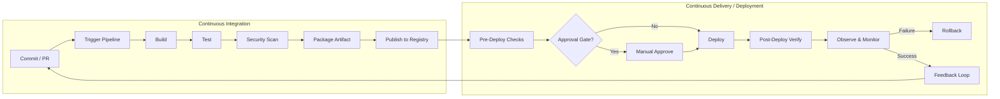

# Complete CI/CD Lifecycle

```
Complete CI/CD Lifecycle
├── Definitions
│   ├── CI — Continuous Integration (merge early, validate fast)
│   ├── CD (Delivery) — always releasable, human gate to production
│   └── CD (Deployment) — automated promotion to production
├── Lifecycle Phases (end-to-end)
│   ├── 1. Source & Trigger
│   ├── 2. Build & Compile
│   ├── 3. Test (unit → integration → contract)
│   ├── 4. Security & Quality Gates
│   ├── 5. Package & Artifact
│   ├── 6. Publish to Registry
│   ├── 7. Pre-Deploy Validation
│   ├── 8. Deploy to Target Environment
│   ├── 9. Post-Deploy Verification
│   ├── 10. Operate, Observe, and Learn
│   └── 11. Rollback & Recovery
├── Cross-Cutting Concerns
│   ├── Artifact immutability & promotion (not rebuild per env)
│   ├── Environment topology (dev → staging → prod)
│   ├── Secrets, config, and feature flags
│   ├── Approval gates & change management
│   ├── Deployment strategies (rolling, blue-green, canary)
│   ├── GitOps vs push-based delivery
│   └── Pipeline observability & DORA metrics
├── Branching & Workflow Models
│   ├── Trunk-based development
│   ├── GitFlow / release branches
│   └── Monorepo vs polyrepo pipeline design
└── Tool Mapping (this repo)
    ├── Jenkins — `06_Jenkins/`
    ├── GitHub Actions — `07_GitHub_Actions/`
    ├── GitLab CI — `08_GitLab_CI/`
    ├── ArgoCD / GitOps — `09_ArgoCD_and_GitOps/`
    ├── Terraform (infra pipeline) — `10_Terraform/`
    └── DevSecOps gates — `14_DevSecOps/`
```

## First Principles

- **Why CI/CD exists:** Manual releases are slow, error-prone, and non-repeatable. A pipeline encodes the release process as code so every change follows the same path — build, test, scan, package, deploy, verify — with an audit trail.
- **Why artifact immutability matters:** If you rebuild the same commit for staging and production, you are not shipping what you tested. The artifact (container image, JAR, Helm chart) built once in CI must be promoted unchanged across environments.
- **Why fast feedback loops win:** A 45-minute pipeline that catches a bug on every commit is cheaper than a 2-hour pipeline that developers learn to bypass. Fail fast at the cheapest stage (lint, unit test) before expensive integration or deploy steps.
- **Why deployment is separate from release:** Deployment puts code in an environment; release exposes it to users. Canary and feature flags decouple "is it deployed?" from "are users seeing it?" — that separation is how you ship safely at high velocity.
- **Why GitOps for CD:** Push-based deploys require CI to hold cluster credentials. Pull-based GitOps (ArgoCD, Flux) inverts trust: the cluster pulls desired state from Git. CI publishes artifacts; CD reconciles configuration — a cleaner security boundary.

---

## CI vs CD: Three Concepts, One Lifecycle

| Term | Meaning | Human gate? | Typical outcome |
|------|---------|-------------|-----------------|
| **Continuous Integration (CI)** | Developers merge small changes frequently; each merge triggers automated build + test | No (fully automated) | Main branch always compiles and passes tests |
| **Continuous Delivery** | Every passing build is *releasable* to production | Yes — manual or approval-gated promote | One-click (or approved) deploy to prod |
| **Continuous Deployment** | Every passing build *automatically* deploys to production | No | Prod updates without human intervention |

Most enterprises land on **Continuous Delivery** for production and **Continuous Deployment** for lower environments (dev, QA). The lifecycle stages are identical; only the promotion policy differs.

---

## End-to-End Lifecycle Diagram



---

## Phase 1: Source & Trigger

Everything starts when code (or infrastructure config) changes.

### What happens

1. Developer pushes a commit or opens a pull/merge request.
2. The VCS fires a webhook to the CI platform (Jenkins, GitHub Actions, GitLab CI, Azure Pipelines).
3. The pipeline runner clones the repo at the exact commit SHA.
4. Metadata is captured: branch, author, PR number, commit message — used for traceability and notifications.

### Trigger types

| Trigger | When it runs | Typical use |
|---------|--------------|-------------|
| **Push to branch** | Every commit to `main`, `develop`, feature branches | CI validation on merge |
| **Pull request** | PR opened, updated, or synchronized | Pre-merge quality gate |
| **Tag / release** | `git tag v1.2.3` pushed | Production release builds |
| **Scheduled (cron)** | Nightly, weekly | Security scans, dependency updates, DR drills |
| **Manual (`workflow_dispatch`)** | Operator clicks "Run pipeline" | Hotfix, re-deploy, infra changes |
| **Upstream pipeline** | Parent pipeline completes | Monorepo orchestration, multi-service deploy |

### Branch protection integration

Production-grade CI requires branch protection rules:

- Required status checks (pipeline must pass before merge).
- Required reviewers.
- Signed commits (optional but common in regulated environments).
- No direct pushes to `main`.

**Repo reference:** `03_Git_and_Version_Control/notes/advanced-git-workflows-and-monorepos.md`

---

## Phase 2: Build & Compile

The pipeline transforms source code into a runnable or deployable form.

### Steps

1. **Checkout** — shallow clone (`fetch-depth: 1`) for speed; full history if versioning depends on tags.
2. **Dependency resolution** — `npm install`, `mvn dependency:resolve`, `go mod download`, `pip install -r requirements.txt`.
3. **Compile / transpile** — `mvn package`, `gradle build`, `tsc`, `cargo build`.
4. **Cache layers** — dependency caches (npm, Maven `.m2`, pip) cut build time dramatically.

### Build environment

- **Ephemeral runners** — fresh VM or container per job; no state leakage between builds.
- **Reproducible builds** — pinned base images, locked dependency versions, deterministic compilers.
- **Build matrix** — test across OS, language versions, or architectures in parallel.

### Container image builds

For containerized apps, this phase often produces a Docker/OCI image:

```dockerfile
# Multi-stage: compile in builder, copy artifact to minimal runtime
FROM golang:1.22 AS builder
WORKDIR /app
COPY . .
RUN CGO_ENABLED=0 go build -o /api .

FROM gcr.io/distroless/static-debian12
COPY --from=builder /api /api
ENTRYPOINT ["/api"]
```

Image tags should be **immutable** and traceable:

- `myapp:sha-abc1234` (commit SHA — best for traceability)
- `myapp:v1.4.2` (semver release tag)
- Avoid `myapp:latest` in production pipelines — it is mutable and breaks rollback.

**Repo reference:** `04_Docker/notes/dockerfile-best-practices.md`

---

## Phase 3: Test

Testing is layered — cheapest tests run first; expensive tests run only if early gates pass.

### Test pyramid in CI

```
        ┌─────────┐
        │  E2E    │  Few, slow, flaky-prone — run on main / pre-prod
       ┌┴─────────┴┐
       │ Integration│  Service + DB + message bus — run on PR or main
      ┌┴────────────┴┐
      │  Unit tests   │  Fast, isolated — run on every commit
      └───────────────┘
```

| Layer | Scope | Speed | CI placement |
|-------|-------|-------|--------------|
| **Unit** | Single function/class, mocked deps | Seconds | Every PR commit |
| **Integration** | Real DB, API, queue (containerized) | Minutes | PR + main |
| **Contract** | Consumer/provider API contracts | Minutes | PR (consumer repos) |
| **E2E / UI** | Full user journey in browser | 10–60 min | Nightly or pre-deploy |
| **Smoke** | Critical path after deploy | Seconds | Post-deploy stage |

### Test practices that matter

- **Fail fast** — run lint + unit tests in parallel before integration.
- **Test parallelism** — split test suites across runners (`pytest -n auto`, JUnit shards).
- **Flaky test quarantine** — retry with limit; quarantine and fix; never silently ignore.
- **Coverage gates** — block merge if coverage drops below threshold (use wisely — coverage ≠ quality).
- **Test data** — ephemeral databases (Testcontainers, Docker Compose in CI) over shared staging DBs.

---

## Phase 4: Security & Quality Gates

Modern pipelines treat security as a gate, not an afterthought.

### Static Application Security Testing (SAST)

Analyzes source code without running it. Finds SQL injection patterns, hardcoded secrets, insecure crypto.

```
Source code → Semgrep / SonarQube / CodeQL → findings → block or warn
```

### Software Composition Analysis (SCA)

Scans dependencies for known CVEs (npm audit, Snyk, Dependabot, Trivy).

```
lockfile → vulnerability DB lookup → CVE report → block critical/high
```

### Container image scanning

After image build, scan layers for OS and application vulnerabilities.

```
docker build → trivy image myapp:sha-abc → fail on CRITICAL unfixed
```

### Secret scanning

Prevent credentials in Git history (GitGuardian, GitHub secret scanning, `gitleaks`).

### SBOM generation

Software Bill of Materials — inventory of all components. Required for supply chain compliance (SLSA, EO 14028).

```
syft myapp:sha-abc → SPDX or CycloneDX JSON → store alongside artifact
```

### Policy-as-code

OPA, Conftest, or Sentinel enforce rules: "no `latest` tag," "image must be signed," "no privileged containers."

### Quality gates summary

| Gate | Tool examples | Typical policy |
|------|---------------|------------------|
| Lint / format | ESLint, golangci-lint, `terraform fmt -check` | Block on error |
| SAST | SonarQube, Semgrep | Block critical |
| SCA | Snyk, Dependabot | Block critical CVEs |
| Image scan | Trivy, Grype | Block CRITICAL |
| IaC scan | Checkov, tfsec | Block high severity |
| License compliance | FOSSA | Block copyleft in proprietary code |

**Repo reference:** `14_DevSecOps/interview.md`, `14_DevSecOps/notes/`

---

## Phase 5: Package & Artifact

The build output becomes a versioned, immutable artifact.

### Artifact types

| Type | Examples | Storage |
|------|----------|---------|
| **Container image** | `myapp:sha-abc1234` | ECR, ACR, GCR, Harbor |
| **Binary / JAR** | `api-1.4.2.jar` | Nexus, Artifactory, S3 |
| **Helm chart** | `mychart-1.4.2.tgz` | ChartMuseum, OCI registry |
| **Terraform module** | versioned module tarball | Private registry |
| **Static site** | `dist/` folder | S3 + CloudFront |

### Immutability rules

1. **Never overwrite** an existing tag in production registries.
2. **Sign artifacts** — Sigstore/cosign for images; provenance attestation (SLSA Level 2+).
3. **Attach metadata** — commit SHA, build ID, pipeline URL, SBOM as OCI annotations.
4. **Retention policy** — keep N versions; garbage-collect untagged images.

### Monorepo considerations

- **Path-based triggers** — only build services whose paths changed.
- **Affected detection** — Nx, Bazel, Turborepo determine build graph.
- **Independent versioning** — each service gets its own semver or SHA tag.

---

## Phase 6: Publish to Registry

Artifacts leave the CI runner and land in durable storage.

### Container publish flow

```bash
# Authenticate (prefer OIDC over long-lived credentials)
aws ecr get-login-password | docker login --username AWS --password-stdin $ECR_URL

# Push immutable tag
docker tag myapp:sha-abc1234 $ECR_URL/myapp:sha-abc1234
docker push $ECR_URL/myapp:sha-abc1234

# Optional: sign
cosign sign --key kms://$KMS_KEY $ECR_URL/myapp:sha-abc1234
```

### OIDC / keyless authentication

Modern CI uses OpenID Connect to assume cloud IAM roles without storing static credentials:

- GitHub Actions → `aws-actions/configure-aws-credentials` with `role-to-assume`
- GitLab CI → `id_tokens` + `sts:AssumeRoleWithWebIdentity`
- Jenkins → `WebIdentityTokenCredentialsBinding`

**Repo reference:** `07_GitHub_Actions/README.md`, `13_AWS/` (IRSA patterns)

---

## Phase 7: Pre-Deploy Validation

Before touching any environment, validate that the artifact is deployable.

### Checks

| Check | Purpose |
|-------|---------|
| **Config validation** | `kubectl apply --dry-run=server`, `helm template` + kubeconform |
| **Policy check** | OPA Gatekeeper, Kyverno dry-run |
| **Diff review** | `terraform plan`, ArgoCD diff, `helm diff upgrade` |
| **Staging soak** | Run full E2E suite against staging with the candidate artifact |
| **Load test (optional)** | k6, Locust against staging before prod canary |

### Environment-specific configuration

**Do not rebuild per environment.** Inject config at deploy time:

- Kubernetes ConfigMaps / Secrets
- Helm values per environment (`values-staging.yaml`, `values-prod.yaml`)
- External Secrets Operator (Vault, AWS Secrets Manager)
- Feature flags (LaunchDarkly, Unleash)

The artifact stays identical; only configuration changes.

---

## Phase 8: Deploy to Target Environment

Deployment strategy depends on risk tolerance, traffic patterns, and infrastructure.

### Environment progression

```
dev → QA → staging → pre-prod → production
         ↑                              ↑
    auto on merge              approval gate / canary
```

| Environment | Purpose | Deploy trigger |
|-------------|---------|----------------|
| **Dev** | Developer integration | Auto on every main merge |
| **QA** | QA team validation | Auto or scheduled |
| **Staging** | Production-like soak | Auto after QA pass |
| **Pre-prod** | Final validation, perf tests | Manual or auto |
| **Production** | Customer traffic | Approval + canary/blue-green |

### Push-based deployment

CI/CD platform holds credentials and pushes changes:

```
CI pipeline → kubectl apply / helm upgrade / terraform apply → cluster
```

**Pros:** Simple, familiar. **Cons:** CI needs powerful credentials; blast radius if CI is compromised.

### Pull-based deployment (GitOps)

CI updates a Git repo with the new image tag; a cluster operator reconciles:

```
CI pipeline → commit new image tag to Git → ArgoCD/Flux syncs → cluster
```

**Pros:** Git is source of truth; no inbound cluster credentials; full audit trail. **Cons:** Two-step mental model (build pipeline + sync).

```yaml
# GitOps repo: apps/myapp/overlays/prod/kustomization.yaml
images:
  - name: myapp
    newTag: sha-abc1234   # CI bot commits this change
```

**Repo reference:** `09_ArgoCD_and_GitOps/README.md`, `Learning_Path/phase-2.5-gitops-integration.md`

### Deployment strategies

| Strategy | How it works | Downtime | Rollback speed | Best for |
|----------|--------------|----------|----------------|----------|
| **Rolling update** | Replace pods incrementally | None (if probes correct) | Slow (roll back revision) | Stateless services, K8s default |
| **Recreate** | Kill all, start new | Yes (brief) | Medium | Dev, batch jobs |
| **Blue-green** | Two full environments; switch traffic | None | Fast (flip traffic back) | Stateful cutover, LB-level switch |
| **Canary** | Shift traffic 5% → 25% → 100% | None | Fast (route traffic away) | High-risk changes, SLO-gated |
| **Feature flags** | Deploy code dark; enable per user | None | Instant (toggle flag) | Product experiments, kill switch |

### Kubernetes rolling update mechanics

```yaml
spec:
  strategy:
    type: RollingUpdate
    rollingUpdate:
      maxSurge: 25%
      maxUnavailable: 0    # zero-downtime: never kill old pod before new is ready
```

Readiness probes gate traffic — a pod is not "deployed" until it passes readiness.

**Repo reference:** `05_Kubernetes/notes/enterprise-kubernetes-architecture.md`, `18_Helm/`

### Infrastructure deployment (Terraform)

Application CD often pairs with infrastructure CD:

```
terraform plan → policy check (Sentinel/OPA) → manual approve → terraform apply
```

State locking prevents concurrent applies. Drift detection reconciles manual console changes.

**Repo reference:** `10_Terraform/interview.md`

---

## Phase 9: Post-Deploy Verification

Deployment succeeding ≠ release succeeding. Verify the running system.

### Verification layers

1. **Health checks** — HTTP 200 on `/health`, gRPC health probe.
2. **Smoke tests** — login, create resource, critical API path (run from pipeline or in-cluster Job).
3. **Synthetic monitoring** — Datadog Synthetics, Pingdom — continuous probes from outside the cluster.
4. **Canary analysis** — compare error rate, latency P99 between canary and baseline (Argo Rollouts AnalysisTemplate, Flagger).
5. **Observability signals** — no new alert firing, error budget not consumed.

### Automated rollback triggers

| Signal | Action |
|--------|--------|
| Smoke test failure | `helm rollback` or `kubectl rollout undo` |
| SLO burn rate spike | Argo Rollouts abort + rollback |
| Error rate > threshold | Flagger automatic rollback |
| Failed sync (GitOps) | ArgoCD sync wave failure → alert + manual intervention |

```bash
# Immediate rollback to previous ReplicaSet revision
kubectl rollout undo deployment/myapp -n production

# Helm rollback to revision N-1
helm rollback myapp 42 -n production
```

**Repo reference:** `15_Observability_and_SRE/notes/incident-management.md`

---

## Phase 10: Operate, Observe, and Learn

CI/CD does not end at deploy — it closes the loop with production feedback.

### What to monitor

| Signal | Tool examples | CI/CD connection |
|--------|---------------|------------------|
| **Golden signals** | Latency, traffic, errors, saturation | Canary gates use these |
| **Logs** | Loki, ELK, CloudWatch | Correlate deploy timestamp with error spikes |
| **Traces** | Tempo, Jaeger, X-Ray | Pipeline OTel traces + app traces |
| **Metrics** | Prometheus, Datadog | SLO dashboards, deploy annotations |
| **Deploy markers** | Grafana annotations, Datadog events | "What changed at 14:32?" |

### DORA metrics (delivery performance)

| Metric | What it measures | Elite benchmark |
|--------|------------------|-----------------|
| **Deployment frequency** | How often you deploy to prod | On demand (multiple per day) |
| **Lead time for changes** | Commit → production | Less than one hour |
| **Change failure rate** | Deploys causing incidents | 0–15% |
| **Mean time to restore (MTTR)** | Incident → service restored | Less than one hour |

Improve the pipeline to improve DORA — faster builds, better tests, safer deploys, faster rollbacks.

**Repo reference:** `16_Platform_Engineering_and_FinOps/`

### Feedback into the pipeline

- Flaky test detected in prod-like staging → quarantine in CI.
- CVE found in running image → trigger rebuild pipeline + emergency promote.
- Incident RCA → add regression test + new smoke check in post-deploy stage.

---

## Phase 11: Rollback & Recovery

Every pipeline needs a defined rollback path before you need it.

### Rollback types

| Type | Mechanism | Speed | Data impact |
|------|-----------|-------|-------------|
| **Application rollback** | Previous image tag / Helm revision | Minutes | None if schema backward-compatible |
| **Traffic rollback** | Shift LB/mesh weight to old version | Seconds | None |
| **Database rollback** | Forward-fix migration (preferred) or restore snapshot | Hours | High risk — avoid down migrations in prod |
| **Infra rollback** | `terraform apply` previous state | Minutes–hours | Depends on resource |
| **GitOps rollback** | `git revert` image tag commit → ArgoCD syncs | Minutes | Clean audit trail |

### Rollback decision tree

```
Post-deploy alert?
├── Smoke test failed → automatic rollback (pipeline)
├── Error rate elevated → canary abort OR manual rollback
├── Latency degraded → scale up first; rollback if not infra
└── Data corruption → stop traffic, restore DB, deploy last known good
```

### Hotfix path

1. Branch from production tag (not from broken `main`).
2. Fix → fast-track CI (skip non-critical stages with explicit approval).
3. Deploy via emergency change process.
4. Backport fix to `main`.

---

## Cross-Cutting: Pipeline Design Patterns

### Fan-in / fan-out (monorepo)

```
         ┌─ build service-a ─ deploy-a ─┐
trigger ─┼─ build service-b ─ deploy-b ─┼─ notify
         └─ build service-c ─ deploy-c ─┘
```

### Multi-environment pipeline (GitLab `environment`, GitHub `environment`)

Same pipeline definition; `environment: production` adds protection rules and secrets scoped to that environment.

### Progressive delivery pipeline

```
build → test → scan → push → deploy canary 5% → analysis (5 min) → 25% → 100% → done
                                      ↓ fail
                                  rollback
```

---

## Approval Gates & Change Management

| Gate type | When | Who approves |
|-----------|------|--------------|
| **PR review** | Before merge to main | Peer developers |
| **Security review** | High-risk changes (auth, crypto) | Security team |
| **Change advisory board (CAB)** | Regulated industries, major releases | Operations leadership |
| **Pipeline environment protection** | Before prod deploy | On-call lead, release manager |
| **Manual `terraform apply`** | Infra changes with blast radius | Platform team |

GitHub Environments, GitLab protected environments, and Jenkins `input` steps implement these gates in code.

---

## Secrets Management in CI/CD

**Never** store production secrets in pipeline YAML or Git.

| Approach | How | Trade-off |
|----------|-----|-----------|
| **CI platform secrets** | GitHub Secrets, GitLab CI variables (masked) | Simple; scoped to repo/group |
| **Cloud secret manager** | Vault, AWS SM, Azure Key Vault — fetched at runtime | Central rotation, audit |
| **OIDC federation** | No long-lived cloud keys in CI | Best practice for cloud deploy |
| **Sealed Secrets / ESO** | Encrypted in Git; decrypted in cluster | GitOps-friendly |

**Repo reference:** `14_DevSecOps/notes/secret-management-vault.md`

---

## Complete Lifecycle Example (Containerized Microservice)

```
1. Developer opens PR #482
2. GitHub Actions triggers: lint → unit test → integration test (Testcontainers)
3. PR merged to main → pipeline builds Docker image → tags sha-abc1234
4. Trivy scan passes → push to ECR → cosign sign
5. CI bot commits sha-abc1234 to GitOps repo (apps/payments/overlays/staging)
6. ArgoCD syncs staging → smoke tests pass in pipeline
7. Release manager approves production environment in GitHub
8. CI bot commits same sha-abc1234 to prod overlay
9. Argo Rollouts: canary 10% for 5 min → AnalysisTemplate checks error rate < 0.1%
10. Promote to 100% → Grafana deploy annotation → Slack notification
11. On failure at step 9: automatic rollback to sha-def5678
```

**Key invariant:** `sha-abc1234` is the identical image in staging and production. Only Git config and traffic routing changed.

---

## Anti-Patterns to Avoid

| Anti-pattern | Why it fails | Fix |
|--------------|--------------|-----|
| Rebuild for each environment | "Works in staging" bugs in prod | Promote immutable artifact |
| `latest` tag in production | Cannot rollback reliably | SHA or semver tags |
| Skipping tests on "hotfix" | Hotfix becomes outage | Fast-track, don't skip |
| CI holds prod kubeconfig | CI compromise = cluster compromise | GitOps pull model |
| Manual deploy steps in runbook | Drift from pipeline; not repeatable | Encode in pipeline |
| No post-deploy verification | Silent broken deploys | Smoke tests + SLO gates |
| Shared staging environment | Test pollution, flaky results | Ephemeral preview environments per PR |

---

## Tool Mapping in This Repository

| Lifecycle phase | Primary tools (this repo) |
|-----------------|---------------------------|
| Source & trigger | `03_Git_and_Version_Control/` |
| Build & package | `04_Docker/`, `06_Jenkins/`, `07_GitHub_Actions/`, `08_GitLab_CI/` |
| Security gates | `14_DevSecOps/` |
| Publish | `04_Docker/` (registries), `13_AWS/` (ECR), `12_Azure/` (ACR) |
| Deploy (K8s) | `05_Kubernetes/`, `18_Helm/`, `09_ArgoCD_and_GitOps/` |
| Deploy (infra) | `10_Terraform/`, `11_Ansible/` |
| Observe & rollback | `15_Observability_and_SRE/` |
| Platform / DORA | `16_Platform_Engineering_and_FinOps/` |

---

## Study Order

1. This document — end-to-end mental model
2. `phase-2-platform-and-delivery.md` — hands-on platform context
3. `06_Jenkins/README.md` or `07_GitHub_Actions/README.md` — pick your CI tool
4. `09_ArgoCD_and_GitOps/README.md` — GitOps CD model
5. `14_DevSecOps/interview.md` — security gates
6. `15_Observability_and_SRE/` — post-deploy operations
7. `capstone-projects.md` — Capstone 1 (single-service delivery platform)

---

## Interview Talking Points

When asked "Explain the CI/CD lifecycle," structure your answer in three layers:

1. **What** — Name the phases: trigger → build → test → scan → package → publish → deploy → verify → observe → rollback.
2. **Why** — Artifact immutability, fast feedback, separation of CI (build) and CD (release), blast-radius control.
3. **How you've done it** — One concrete example with your stack: "We used GitLab CI to build and push to ECR, ArgoCD synced from a GitOps repo, canary analysis gated on Prometheus error rate, rollback via `kubectl rollout undo`."

Depth beats tool name-dropping. Interviewers want to hear you reason about trade-offs — push vs pull deploy, canary vs blue-green, when to gate vs when to automate.
